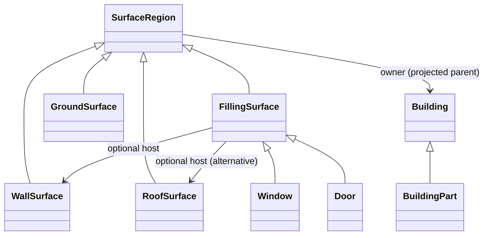

# Building opening surfaces and their hosts

This milestone document records historical implementation evidence. For current
wire support and schema coverage, see [the native inventory](model-inventory.md)
and [standard I/O contract](standard-schema-io.md). Old wire readers and legacy
serialization paths described below have since been removed.

Status: implemented local slice, 10 September 2026. Governed by
[Core Design](../../DESIGN.md) and the [model contract](model-contract.md).
The self-contained schema is
[buildings/0.2.0/schema.yaml](../../sandbox/model_profiles/profiles/buildings/0.2.0/schema.yaml).
Version 0.1.0 remains unchanged and usable independently.

## Standards decision

[CityJSON 2.0.2 §3.3](https://www.cityjson.org/specs/2.0.2/#semantics-of-geometric-primitives)
defines Window and Door semantic surfaces and optional geometry-local parent and
children references. These describe a surface's host wall or roof. They are
distinct from the Building/BuildingPart containment hierarchy.

[CityGML 3.0 Construction](https://docs.ogc.org/is/20-010/20-010.html#construction-uml)
distinguishes physical Window/Door filling elements from WindowSurface/DoorSurface
filling surfaces. This DTCC slice models the latter, using CityJSON's Window/Door
spellings in the experimental DTCC vocabulary. It does not claim that a polygon
is the complete physical window object, nor assert formal ontology equivalence.

No hole is automatically a window, and no host is inferred from geometry. A
window surface has its own element membership; its wall excludes that area. A
door reaching ground can be a notch in the wall's exterior ring. Polygon holes
alone convey topology, not opening classification or identity.

## Native contract and Python access

`SemanticRegion.parent: int | None` is the only new native fact. It indexes the
same geometry's ordered `regions` list, independently of optional region IDs.
It never crosses representations or objects. Parents must be valid Python integer
indices and form an acyclic forest. Children are derived; there is no second
relationship store or domain-specific Python class.

```python
from dtcc_core import io

city = io.load_city("sandbox/model_profiles/fixtures/openings.city.json", strict=True)
geometry = city.buildings[0].building_parts[0].lod3
window = geometry.regions_of("https://example.org/dtcc/Window")[0]
polygons = [geometry.surfaces[i] for i in window.indices]
wall = geometry.regions[window.parent] if window.parent is not None else None
print(window.attributes["name"])  # window-1
print(wall.attributes["name"])    # front-wall
openings = [r for r in geometry.regions if r.parent == window.parent]
```

Indices give direct access with no registry, ID generation or resolution cache.
They also impose an explicit editing rule: reordering/removing regions requires
remapping parent indices, just as changing surfaces/faces requires remapping
element indices. An in-range but unintended reference after manual reordering
cannot be detected by a validator. Append-only edits leave existing references
stable. Optional IDs remain metadata and are not an alternative reference store.

`MultiSurface.merge` offsets both incoming element membership and parent indices,
copying region metadata. The existing semantic mesher preserves region order and
parent links while mapping polygon membership to triangles. Other topology-changing
operations remain unsupported unless they define a semantic mapping. A host
relationship does not add a child's polygons/triangles to the parent's membership.

## Profile and exchange boundaries

The disposable LinkML projection retains `parent` as the owning Building/Part for
all regions. A native region-parent link projects as optional `host`. Profile
0.2.0 adds abstract FillingSurface and concrete Window/Door, with host ranges
WallSurface or RoofSurface. Those type rules live only in YAML. Both a missing
host and a roof-hosted opening are allowed; unlinked source regions are preserved.
Open attributes remain supported, but undeclared projected relationships fail
instead of escaping graph checks. Profile validation remains optional developer
tooling; it neither certifies geometry nor reconstructs a model from projection.



Canonical wire **v4** adds optional SemanticRegion field 5, `parent`; absent and
zero remain distinct. This milestone introduced v4; the subsequent
[mixed-city milestone](model-semantic-coverage.md) introduces v5. Current writers
emit v5 and readers accept v1–v5. V1–v3 declarations
cannot carry parent links. Frozen v1/v2/v3 fixtures protect older reads. For a
model with no region links, its v4 payload differs from v3 only in the envelope
version. Package manifests remain v3: their model-schema-version field identifies
the embedded wire version, independently of profile version 0.2.0. Legacy exports
already reject regions, so they cannot silently lose this new fact.

Strict CityJSON import admits parent-only, children-only and matching two-sided
declarations. Supplied children lists must agree with all known links. Malformed
indices, duplicate children, conflicting parents, self-links and cycles fail.
Export writes parent and derived children in region order. Presence/absence of
redundant inverse keys, empty child lists and child-list ordering are normalized;
relationships, semantic entity order, geometry and attributes are preserved.
Native region IDs still need an explicit CityJSON extension mapping and fail
export. No synthetic IDs or physical filling objects are introduced.

## Reproduce and evidence

From the repository root, using the existing DTCC environment and isolated
LinkML environment described in the [sandbox](../../sandbox/model_profiles/README.md):

```bash
../venv/bin/python sandbox/model_profiles/openings_example.py /tmp/dtcc-openings
../venv/bin/python sandbox/model_profiles/buildings_example.py /tmp/dtcc-buildings.json
PYSTOW_HOME=/tmp/dtcc-profile-pystow /tmp/dtcc-model-profile-85-env/bin/python sandbox/model_profiles/evaluate_openings.py /tmp/dtcc-openings/profile.json /tmp/dtcc-buildings.json
../venv/bin/python -m pytest tests/io/test_building_openings.py -q
```

The checked-in synthetic building has a 10 × 10 × 6 m shell, a front wall with one
window hole and one door notch, a roof and ground surface. Public file, package,
CityJSON and mesh round trips pass. Triangulation preserves wall/window/door areas
of **50/4/6 m²** and total surface area **440 m²**, and retains links and independent
metadata. A Solid variant exercises shell-nested semantic assignments. Tests also
cover generic deep hierarchies, merge remapping, malformed persisted links and
declared-version failures. These checks do not certify general solid validity.

Both source and exported fixture passed the published CityJSON 2.0.2 JSON Schema
(local recorded SHA-256 `74e128f4505429775fb97da4132a06e2fb3b88116332d7f6893529841fb3505e`).
The portable profile evaluator passed new/old version coexistence, invalid host
type, dangling host, absent host and undeclared-relationship cases. Existing
7-case buildings and 18-case original profile evaluations also passed.

The affected regression run passed **1,315 tests**, with 1 skipped and 53
deselected, in 39.48 s (model, IO, datasets, reproject and meshing suites).
After the final version-read adjustment, all 56 focused canonical, representation,
package and openings checks passed again; compilation and `git diff --check` passed.
Evidence artifacts for this run are in `/private/tmp/dtcc-openings-evidence/`.
The complete 24,504,507-byte 3DBAG v3 tile loads and rewrites exactly after restoring
only the v3 envelope version; no-opening model facts remain unchanged.

A three-run warmed, alternating-order codec check compared the pre-parent codec
paths with this implementation, using the same current native dataclasses and
unchanged v3 tile. Reading the immutable envelope version once removed most of
the initially measured 2.7% overhead: final medians were **2.098 s control and
2.106 s current** (0.4% difference). This is a codec timing control, not an
independent old-runtime memory benchmark or a cross-platform performance claim.
Raw runs and the reconstructed control source are retained in the evidence folder.

Remaining work includes physical filling elements, further thematic classes and
metadata, topology operations beyond triangulation/merge, and production profile
integration. Full CityGML/CityJSON conformance and downstream wire consumers are
not certified. A durable vocabulary namespace is still needed before release.
