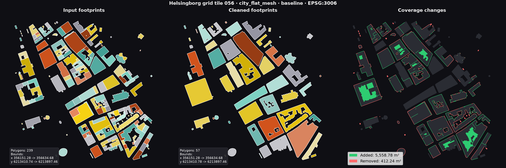
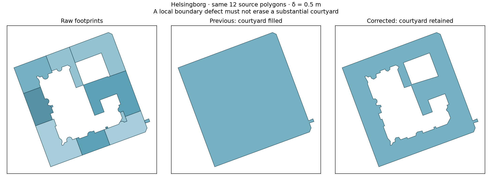

# Cleaning contract: observational comparison

17 September 2026. Companion evidence for the
[contract specification](footprint-cleaning-contract.md). The first sections
record the initial candidate observations. The follow-up below records the
adopted contract and first implementation correction.

## Reproduction and provenance

From dtcc-core:

```sh
.venv/bin/python sandbox/cleaning_contract_probe.py \
  --output /tmp/dtcc-contract-probe-20260917 \
  --run benchmarks/runs/2026-09-17_100049_quick
```

The script writes `examples.png` and `observations.json`. Without `--run`, it
executes only the six deterministic synthetic examples. No network access is
needed. The city survey reads one saved flat-task cleaning artifact per city,
not fresh downloads or newly cleaned data. Input geometries are not modified.
The city snapshots remain local untracked benchmark artifacts, not a portable
corpus included in this document.

The synthetic examples use the production cleaner at core `1a106fc`, with only
this probe/documentation under development. The saved city run records core
`4f95f04b36025ffb497b7d65113e6b7e4dcbc506` with a dirty tree: this is not an
immutable revision attribution for those outputs. The exact local run name and
its saved raw/cleaned geometries are the evidence source. The same cities later
passed flat meshing and, after the classification fix, saved-input surface
meshing; that establishes workflow success, not the proposed fidelity bound.

## What the checker measures

The initial prototype (now replaced by the shared core checker) computes the graph independently of the cleaner's
private defect detectors. It nodes boundaries, suppresses collinear degree-two
vertices, checks pairwise interior disjointness and occupied-boundary topology,
and queries vertex/vertex and nonincident vertex/edge separations below delta.
Minimum separation is capped at delta, so `≥ 0.5` is a lower bound, not an exact
minimum. Numerical comparison tolerance is 0.0000005 m at delta = 0.5 m.

Fidelity reports two areas at epsilon = 0.25 m:

- **Lost protected area:** `(P eroded by epsilon) minus Q`.
- **Added outside budget:** `Q minus (P dilated by epsilon)`.

Both must vanish for the proposed inclusion rule. This is spatially local and
cannot be satisfied by cancelling area added in one place against area removed
elsewhere. Positive areas are observations under this exploratory budget, not
new production failures.

Round buffers use 32 segments per quadrant. The probe also checks radii on
either side of epsilon, separated by a band wider than the circular chord
approximation error (about 0.0754 mm at epsilon = 0.25 m). Borderline cases would
be reported as such. This brackets buffer-resolution sensitivity but is not a
proof of exact arithmetic or of all GEOS numerical errors. No reported city
result was borderline. All raw polygons in this sample were valid.

An initial summed-area overlap estimate produced floating-point cancellation
residuals around 1e-11 m². Those were measurement artefacts. The final topology
probe uses pairwise interior-intersection predicates; all ten city outputs have
zero overlapping interior pairs and no nonmanifold occupied-boundary vertices.

## Results

All six synthetic inputs and their outputs are illustrated in the specification.
Five current outputs satisfy both proposed obligations. The sixth is the
3 × 3 m building deleted by the existing 15 m² area filter: output is admissible
but its deletion loses 6.25 m² of protected occupied core. The sharp triangle and
the rectangle with a redundant collinear vertex retain exactly the same occupied
set, showing that this candidate does not force all sharp angles or dense
collinear sampling to be removed.

All ten city outputs pass the existing production cleaning contract:

| City, tile 056 | Separation, m | Candidate admissibility | Lost protected area, m² | Added outside budget, m² |
| --- | ---: | --- | ---: | ---: |
| Lund | ≥ 0.5 | Pass | 227.19 | 547.25 |
| Stockholm | ≥ 0.5 | Pass | 43.84 | 12.51 |
| Gothenburg | ≥ 0.5 | Pass | 92.09 | 66.14 |
| Malmo | 0.4698 | Below nominal scale | 35.19 | 8.22 |
| Uppsala | ≥ 0.5 | Pass | 50.66 | 44.42 |
| Linkoping | ≥ 0.5 | Pass | 101.22 | 36.47 |
| Orebro | ≥ 0.5 | Pass | 35.73 | 19.42 |
| Vasteras | ≥ 0.5 | Pass | 67.38 | 31.79 |
| Helsingborg | ≥ 0.5 | Pass | 179.04 | 5056.55 |
| Norrkoping | 0.4903 | Below nominal scale | 83.37 | 25.88 |

Eight city outputs meet nominal 0.5 m separation. Malmo (0.46979 m) and Norrkoping
(0.49029 m) fall below it, but are above 0.5 − 0.03125 m. The existing contract
records a 0.03125 m tolerance in all ten cases. This is a specification decision:
if such a margin is intended, declare it explicitly before cleaning. Do not
silently derive allowable shortfalls from repair diagnostics.

Every city exceeds the exploratory fidelity budget. This does not establish that
0.25 m is the correct application budget, or identify which repair stage caused
each change. It demonstrates that current geometric acceptance and mesh success
do not constrain fidelity in this way.

## Helsingborg: a useful first counterexample

The existing benchmark reports 5,558.78 m² added and 412.24 m² removed. The plot
shows several substantial courtyard regions becoming occupied, while current
cleaning and subsequent meshing both succeed.



This is not merely a choice between 0.25 m and 0.5 m numerical tolerances:

| Epsilon, m | Lost protected area, m² | Added outside budget, m² |
| ---: | ---: | ---: |
| 0.25 | 179.04 | 5,056.55 |
| 0.50 | 101.24 | 4,720.56 |
| 1.00 | 19.56 | 4,118.46 |

These extra sensitivity measurements use the same saved geometry and probe
function. We have not yet traced the responsible repair operator. If retaining
substantial open courtyards is intended, this fixed case should drive the first
fidelity investigation rather than widening the budget to fit today's output.

## Verification and next decision

Executed six production-cleaner examples and measured ten saved city outputs.
Also checked the probe against shared-edge, point-touch, overlap, tiny-bend,
separated-component and empty geometries; checked protected building deletion,
permitted subscale deletion and a remote spurious addition. All nine focused
predicate checks gave their expected outcomes. Figures were visually inspected.
No production code, acceptance threshold or existing test was changed.

The next decision is whether to adopt the two-sided spatial budget and separate
area filtering. Then choose an explicit numerical separation margin and extract
one Helsingborg courtyard as a small fixed regression input. Production checking
and repair changes should follow those decisions, not precede them.

## Adopted contract and first correction

The target contract is now adopted, with epsilon = delta / 2 initially and
explicit separation of area selection. `dtcc_core/builder/cleaning/contract.py`
is the authoritative independent measurement implementation. New benchmark
results include its report and show `Resolved` and `Fidelity` in the cleaning
table. Legacy readiness checks still control execution while remaining target
violations are corrected.

The portable regression input is
[`helsingborg-courtyard.geojson`](../../tests/data/cleaning/helsingborg-courtyard.geojson):
twelve original source polygons contributing to cleaned region 1 of the saved
Helsingborg tile. Its provenance records original source indices, tile bounds,
parameters and EPSG:3006. This extraction uses `flatten_geometry(LOD0)` with
zero polygon simplification. The initial city probe used `Building.footprint()`,
which silently simplified by 0.01 m; follow-up figures below use the untouched
source coordinates. This accounts for small differences in baseline areas.

Tracing the existing cleaner found `_regularize_low_clearance_polygons` calling
`_remove_meshing_hostile_holes`: a local boundary clearance defect caused an
entire 2,135.31 m² courtyard to be filled. The correction keeps holes with a
nonempty erosion by half the resolution, allowing existing local repairs to
operate. It does not add another repair operator.



On the extracted block, added area outside the 0.25 m band falls from
2,050.14 to 0.49 m². Both outputs pass graph admissibility, but the corrected
block still loses 0.50 m² of protected occupied area and therefore does **not**
yet meet the complete fidelity contract. The regression checks that a protected
interior point stays open and detects the previous wholesale deletion; it does not declare
these remaining deviations acceptable.

### Same-input city comparison

All ten saved flat-task source cities were cleaned with the correction and
meshed as flat and surface meshes. Surface inputs reuse saved terrain and
heights from `/private/tmp/dtcc-surface-classification-fix-20260917`; no downloads
were required. Building counts and exact 2D footprint coordinates match the flat-task inputs
at every source index. The independent dataset loads assigned different object
IDs; this comparison uses the verified positional geometry correspondence. The loaded mesher is the core environment's pinned commit
`7ada8a89c98dbbedc34213387ee598bd92826f10`, not the sibling checkout. Core base is
`1a106fc` plus the working-tree guard and independent checks.

[Machine-readable measurements](footprint-cleaning-courtyard-results.json)
record bounds, parameters, geometric checks, mesh quality tails and timings.
The full local investigation is `/private/tmp/dtcc-courtyard-20260917`.

| City | Added outside budget, before → after, m² | Lost protected area, before → after, m² |
| --- | ---: | ---: |
| Lund | 547.17 → 187.97 | 226.85 → 227.40 |
| Stockholm | 12.51 → 12.51 | 43.87 → 43.87 |
| Gothenburg | 66.15 → 66.15 | 92.13 → 92.13 |
| Malmo | 8.22 → 8.22 | 35.19 → 35.19 |
| Uppsala | 44.43 → 44.43 | 50.79 → 50.79 |
| Linkoping | 36.44 → 26.08 | 101.16 → 69.26 |
| Orebro | 19.42 → 19.42 | 35.75 → 35.75 |
| Vasteras | 31.79 → 31.79 | 67.44 → 67.44 |
| Helsingborg | 5056.54 → 89.45 | 179.11 → 187.45 |
| Norrkoping | 25.92 → 25.92 | 83.40 → 83.40 |

All twenty meshes build with zero degenerate elements. Eight cleaned cities
meet nominal graph resolution; Malmo and Norrkoping retain their pre-existing
shortfalls. All ten still fail fidelity. The largest added-area improvement is
Helsingborg (98.2%), but its lost protected occupied area increases by 8.34 m².
The guard is a substantial local correction, not complete conformance.

Quality and runtime tradeoffs remain visible:

- Lund's minimum element quality falls from 0.137 to 0.067 in flat and surface
  meshes. Flat p01 changes from 0.619 to 0.618; surface p01 from 0.327 to 0.298.
- Helsingborg flat p01 changes from 0.623 to 0.617; its minimum and surface p01
  are essentially unchanged. Other city quality changes are small or absent.
- Sequential same-session replay of the legacy helper versus the corrected
  helper takes 11.14 → 13.96 s for Helsingborg and 13.53 → 13.96 s for Lund.
  These are single samples, not statistical performance estimates. Retaining
  the previously erased courtyards gives later repairs and meshing more work.

Four older tests explicitly required erasing protected holes or counted that
operator's application. Those expectations now require preservation; unrelated
clearance, short-edge, source mapping and mesh-boundary checks remain active.
The new raw-block regression fails with the legacy helper and passes with the
correction. Reproduce the portable checks without downloads:

```sh
.venv/bin/python -m pytest -q tests/builder/test_cleaning_contract.py
```

The next slice should constrain remaining repairs against the original fidelity
reference and separate area selection. Do not widen epsilon to make this corpus
pass, or restore courtyard deletion to improve mesh scores or runtime.

## Step 2: selection and fixed-reference candidate admission

Minimum area is no longer a conditioning option or a branch-ranking criterion.
`select_footprints(cleaned, min_area=...)` is an explicit, non-mutating operation
on cleaned regions. Dataset adapters still apply their `min_building_area`
after the final mesher-ready normalization. Exclusion counts, areas and source
maps are reported separately, against the original source index space. This
removes the area-driven absorption stage and its obsolete tests. Roughly 500
lines of repair/filtering/ranking machinery were deleted from `footprints.py`.

The existing optional void and final-shape stages now use one `FidelityBudget`
prepared from the original interpreted input. It reuses the independent
checker's offset bounds and numerical convention. Definite-pass admission
prevents repeated edits from each receiving a fresh epsilon. A focused test
submits two 0.2 m wall movements: the second fails admission with epsilon =
0.25 m, and both are admitted with epsilon = 0.5 m. Upstream repairs and later
mesher-ready normalization are not yet guarded end to end.

All ten fixed cities were rerun through cleaning, explicit selection, flat
meshing and surface meshing. All twenty meshes built with zero degenerate
cells. The loaded mesher, raw coordinates, terrain and heights are the same as
in the previous comparison. No data was downloaded. Full results are in
[`footprint-cleaning-selection-results.json`](footprint-cleaning-selection-results.json);
local outputs and investigation scripts are in `/private/tmp/dtcc-contract-step2`.

The following compares total raw-to-selected damage with the previous step,
so the improvements cannot be explained merely by relabeling area exclusions:

| City | Lost protected area, before → after, m² | Added outside budget, before → after, m² | Explicitly selected out |
| --- | ---: | ---: | ---: |
| Lund | 227.40 → 215.66 | 187.97 → 108.46 | 26 |
| Stockholm | 43.87 → 30.42 | 12.51 → 2.16 | 4 |
| Gothenburg | 92.13 → 90.38 | 66.15 → 0.46 | 10 |
| Malmo | 35.19 → 24.90 | 8.22 → 0.89 | 0 |
| Uppsala | 50.79 → 37.02 | 44.43 → 10.33 | 3 |
| Linkoping | 69.26 → 54.39 | 26.08 → 6.96 | 7 |
| Orebro | 35.75 → 22.59 | 19.42 → 15.10 | 3 |
| Vasteras | 67.44 → 64.07 | 31.79 → 16.35 | 5 |
| Helsingborg | 187.45 → 177.64 | 89.45 → 45.14 | 20 |
| Norrkoping | 83.40 → 71.67 | 25.92 → 6.50 | 9 |

Both damage measures improve in every city in this sample. They do not vanish:
all ten cleaning-only results still fail fidelity, and Malmo/Norrkoping retain
nominal resolution shortfalls. Helsingborg illustrates the new accounting:
cleaning loses 28.21 m² of protected occupied interior and adds 45.14 m² outside
the band; the subsequent 15 m² selection removes 20 regions totaling 213.29 m².
The raw-to-selected protected-interior loss is 177.60 m². Total excluded area
and protected-interior loss are different measurements and are not interchangeable.

Quality is still a separate acceptance dimension. Lund surface p01 improves
0.298 → 0.310; Stockholm surface p01 decreases 0.380 → 0.365, and Malmo's
surface minimum decreases 0.338 → 0.264. Linkoping's minimum improves
0.163 → 0.181. No universal mesh-quality guarantee is inferred. Single-sample
cleaning times are broadly similar (Lund 13.96 → 13.19 s, Helsingborg
13.96 → 14.09 s); they include the new independent pre-selection check.

Verification: 332 focused tests passed, 6 optional native-backend tests skipped.
A final 33-test checker/benchmark run passed after formatting and report updates.
The six-example probe now disables area selection and all six examples pass,
including preservation of the 3 × 3 m building. A manual negative-epsilon check
fails clearly; all ten generated handoffs load successfully. Four further focused
checks passed after aligning the default epsilon with the
declared meshing scale, including the zero-feature-scale case. One old test
required edges longer than 1 m despite requesting 0.5 m resolution; it now
checks the requested 0.5 m bound. The ordinary benchmark report, plotting and
saved-input replay paths are covered, including the artifact-loading boundary.
No native code changed; no full 1,000-tile or volume survey was run.

Next: locate the first fidelity violations in upstream stages on these saved
inputs and extend the same original-input admission boundary there. Do not add
new shape-specific repair rules or turn current branch diagnostics into further
contract requirements.


## Step 3: trace opening and preserve shared occupied cores

Tracing each existing stage against the **original raw occupied union** locates
the first fidelity breach at `opened` in all ten fixed cities. This includes
opening, precision canonicalization and small-hole removal. Closing repairs
some temporary cracks: Stockholm, Gothenburg, Malmo and Vasteras return to a
fidelity pass at `regularized_groups`, before later stages lose it again.
Lund's opening loses 1.59 m² of protected interior and adds 3.10 m² outside the
band; Helsingborg adds 19.28 m². Measurements and stage order are in
[`footprint-cleaning-opening-results.json`](footprint-cleaning-opening-results.json).

A separate Lund operator probe distinguishes the mechanisms. Canonicalization
alone loses 0.73 m² of protected union interior; opening without snapping loses
0.17 m² and adds 2.38 m² outside the band. Adding the default small-hole removal
does not change the measured opening result. Per-building operations can
create cracks along walls that are internal to the occupied union. The current
mitred opening is also not guaranteed to stay inside the original footprint.
These are geometric effects, not merely report thresholds.

A minimal example exposes a complete-disappearance bug independently of the
city data: two adjacent 0.3 × 10 m strips form one resolved 0.6 × 10 m building.
Each strip's individual erosion by 0.25 m is empty, but their union retains
0.95 m² of protected occupied interior. Previously opening deleted both strips.
It now consults the existing original-input `FidelityBudget` before discarding
an entire part and preserves parts containing protected interior for subsequent
coverage operations. The example now passes the complete contract and keeps
both source indices. The regression failed against the previous implementation.

This is deliberately a disappearance safeguard, not a claim that opening now
satisfies fidelity. Whole-coverage, individual-part and connected-group admission
experiments were evaluated and removed. They made some early stages more faithful
but triggered worse downstream repairs. For Lund, the whole-coverage fallback
increased final cleaning-only protected loss from 108.28 to 167.57 m² and reduced
surface p01 from 0.310 to 0.212. Individual-part admission kept p01 near 0.310,
but lost 166.48 m² and introduced a nominal resolution failure. Its stage trace
locates the main amplification in coverage contact regularization: protected
loss jumps from 6.25 to 166.48 m². Connected-group admission also regressed.
No experimental option, alternative repair stack or production tracing API
remains. The evidence retains these outcomes because they determine the next
implementation boundary.

The retained change leaves all ten saved handoff geometries and source maps
**exactly unchanged** compared with step 2. It does not activate on these city
inputs; its protection is demonstrated by the shared-wall regression. Contract
reports and measured flat/surface mesh quality statistics are also unchanged.
All twenty meshes build, with zero degenerate cells. Total single-sample cleaning
time is 45.22 → 45.41 s across the ten inputs; this is not a statistical timing
claim. Eight cases still meet nominal resolution and all ten still fail fidelity.
The same pinned mesher, raw inputs and prepared surface inputs were used, without
downloads. Local investigation material is in `/private/tmp/dtcc-contract-step3`.

Verification: **333 passed, 6 skipped** across the focused builder, benchmark and
dataset tests. The ordinary `bench quick --dry-run` succeeds; a negative epsilon
fails clearly. The shared-wall example uses the public conditioner, and fixed-city
replay uses `build_conditioned_footprints` followed by the ordinary flat/surface
builders. No native code changed or full volume survey was run.

Next: extract the Lund contact-repair amplification into a small fixed case and
use it alongside the shared-wall example to revise early coverage regularization
and downstream admission together. A locally passing stage is insufficient if
the final result becomes worse. Keep one original fidelity reference and resolve
the geometry of shared occupied space before removing compensating stages.


## Step 4: a structural reproducer and a construction direction

The user's caution about trial-and-error changes the next step: no further
case-driven production guard was added. The [pipeline design](footprint-cleaning-pipeline.md)
derives independent interaction groups from the existing contract and specifies
a limited shared-graph construction to evaluate before further replacement work.

The Lund amplification now has a portable three-polygon contact-stage fixture,
with 55 original source polygons and explicit capture provenance. The near pair
is over 6.14 m from the third footprint. That footprint is unchanged when the
contact routine receives it alone, but global postprocessing is activated by
the pair and removes 122.13 m² of its incoming protected interior. Its original
raw-source protected loss rises from 0.0114 to 121.38 m². The standalone subset's
neighborhood differs from the full-city run; it demonstrates nonlocal coupling,
not identical full-city totals or a new raw-to-mesh benchmark tile.

The diagnostic probe also verifies that round offsets can preserve fidelity
without resolving the polygon graph; an integer coordinate grid can still put
a vertex within 0.0995 m of a nonincident edge; and projecting a candidate back
inside its fidelity band can reintroduce a 0.2 m gap. These counterexamples
separate actual guarantees from plausible-looking constructions. The current
production pipeline remains unchanged, so no new mesh-quality improvement is
claimed. See the design for the reproduction command and next acceptance path.


## Step 5: bounded shared-graph simplification

The [pipeline design](footprint-cleaning-pipeline.md#bounded-prototype-results)
now records an implemented prototype and its fixed-corpus evaluation. It accepts
only shared degree-two vertex removals that preserve topology and the original
fidelity band; it has no production callers or shape-specific repair fallbacks.
All ten raw city outputs pass fidelity, but none passes the complete contract.
Across 538 independent groups, 252 were already resolved and 93 more were resolved.
The remaining 79 topology-blocked, 82 shortcut-exhausted and 32 work-limited groups
show why this restricted method cannot replace the current pipeline.

The protected courtyard remains faithful. The Lund raw subset's distant block
is identical with and without the triggering pair. Eight prototype tests and
fifteen contract tests pass. A conforming shared-wall result reaches the existing
flat mesher without invoking legacy cleaning, producing 145 triangles and zero
degenerates. Full-city unresolved candidates were not passed off as accepted
cleaning or used for a claimed mesh-quality improvement. Production geometry
code is unchanged by this step. The next work is a principled topology construction
inside the fixed original band; see the design and existing implementation plan.

## Step 6: topology as a joint occupancy choice

The [pipeline design](footprint-cleaning-pipeline.md#topology-construction-as-constrained-occupancy-selection)
now specifies finite occupancy selection inside the original band. A small oracle
in the existing pipeline probe handles four explicit analytic partitions with
the same rule: separate a point contact, bridge a gap, close a courtyard entrance
while retaining its open core, and fill a tiny hole. All four pass the full
contract, with zero measured protected loss or addition outside the budget.

This is evidence for the decision rule, not an automatic partition generator.
The point contact requires two coordinated choices; without candidate cuts,
the same input has no solution in its supplied partition. Search exhaustion
therefore remains distinct from geometric infeasibility. Required internal
source walls are outside this binary occupancy experiment. The production
cleaner and fixed-city results are unchanged.

Five new focused tests and the existing graph/contract checks pass (28 total).
The ordinary probe, missing-output failure and figure were checked. Details are
in `footprint-cleaning-topology-results.json`. Next: derive one automatic candidate
partition and measure its size and geometric coverage before considering a faster
solver or production integration.

## Step 7: automatic candidate geometry and a rejected construction

The [pipeline design](footprint-cleaning-pipeline.md#automatic-candidate-generation-local-chords)
now records one automatic local-chord construction, evaluated without case-specific
cuts or tuning. It represents conforming alternatives in all four analytic
examples, but produces 1,336–12,163 free cells before search. This is representation
evidence, not successful automatic cleaning.

The fixed ten-city measurement covers 538 original interaction groups. The 252
already-resolved groups need no proposals. Of the remaining 286, 249 reach a
fixed construction cap and 37 generate invalid partitions. An inspected Lund
partition contains self-intersecting thin cells. No invalid-cell cleanup, relaxed
tolerance, new dependency or larger search limit was introduced.

The evidence rejects eager subdivision by every alternative chord as the next
production construction. The next step is to select compatible boundary routes
before forming their regions, while retaining joint fidelity/topology/separation
constraints. Production behavior and previous city mesh results are unchanged.
There are 31 passing focused tests; the ordinary and saved-city probe paths ran.
Counts, bounds, timing scope and the invalid-cell example are in
`footprint-cleaning-carrier-results.json`.

## Step 8: selecting boundary routes jointly

The [route model](footprint-cleaning-pipeline.md#selecting-boundary-routes-before-constructing-regions)
selects noncrossing directed cycles from the same automatic candidates and only
then constructs regions. All four analytic examples now pass automatically.
An independent final check still owns acceptance; limits and finite-model
infeasibility remain unresolved outcomes. No shape-specific repair was added.

The fixed corpus yields 15 additional conforming groups and 252 unchanged ones.
Thirteen of the fifteen also passed the simpler vertex-removal prototype; two
had stalled there. None of the complete cities passes. Most unresolved groups
still hit candidate generation caps (233); another 23 hit the constraint cap.
The five-second solve target can return a conforming incumbent with avoidable
corner changes, so these are not minimum-change results or a production-ready
replacement. The inspected figure displays the actual returned shapes.

There are 36 passing focused tests. The saved gap result builds 389 flat
triangles with zero degenerates and p01 0.6444 through the existing builder with
legacy footprint cleaning disabled. Full-city meshing is not claimed. Production
behavior remains unchanged. Provenance, outcome counts and timing scope are in
`footprint-cleaning-route-results.json`. Next: reduce the candidate family while
checking which solutions it retains; keep source-wall and attribution requirements
explicit before integration.

## Step 9: restrict choices to unresolved features and measure the tradeoff

The existing route probe now has an explicit `--focused` research comparison.
It generates new routes around unresolved input features and fixes unrelated
original edges. The contract, original fidelity reference and work limits are
unchanged. Long walls involved in a narrow gap remain editable. The default
reference and production cleaning behavior remain unchanged.

All four analytic solutions are still represented, verified with independent
witnesses against the actual linear model and full geometric contract. Timed
search finds only two of them; gap and courtyard return no incumbent. On the
fixed cities, 43 additional groups pass instead of 15, but only twelve previous
successes are retained. Three previous successes return no incumbent and 31 new
groups pass. All 252 already-conforming groups stay unchanged; no complete city
passes. Thirty-six of the 43 repairs also passed vertex removal; seven had stalled
there. The simpler prototype still has greater total coverage.

Proposal caps fall from 233 to 153 groups, while constraint caps rise from 23 to
53. Total measured group time rises from 194.67 to 405.89 s as more groups reach
the solver. This supports locality as a useful restriction, but does not establish
a practical replacement cleaner. No mesh rerun or production improvement is
claimed. Details are in the existing route results manifest's
`focused_experiment` section and the pipeline design.

All 38 focused tests pass, including analytic representation and a vertex/edge
conflict with no close vertex pair. CLI success/error paths and the figure were
checked. One additional CLI regression passes: an unresolved rerun removes its
old successful GeoJSON instead of leaving misleading output. Next: replace the
model's pairwise turn implications with an equivalent
compact formulation, proving it preserves integer route choices before changing
code. This targets a measured cost without introducing another geometric repair
rule or weakening the contract.

## Step 10: compact equivalent turn constraints

The route model now expresses the corner requirement once per incoming route,
instead of once per incompatible incoming/outgoing pair. The proof uses the
existing binary flow invariant. A pre-edit exhaustive algebra check and a
maintained geometric junction test support it; all four analytic witnesses
remain represented. Candidate geometry, fidelity and work limits are unchanged.

All four focused examples now pass automatically (previously two). The fixed
cities have 72 additional conforming groups versus 43: 42 successes retained,
one lost to no incumbent, and 30 newly passing. All 72 accepted repairs pass the
full contract and are reported optimal within solver tolerances. Twenty-three
were not solved by the simpler vertex-removal prototype, which still has higher
total coverage. Constraint caps fall from 53 to 26; site/chord caps remain 153.
Measured time is roughly unchanged at 396.14 versus 405.89 s. No complete city
passes and no production or mesher change is claimed.

Reaching a larger Uppsala model exposed an edge-identity bug: two original parents
rounded to one sampled endpoint pair, overwriting a graph entry but retaining
both costs. Separate route identities now preserve the parents and costs;
existing overlap constraints prevent selecting both. A one-ulp thin triangle
reproduces the problem without a city-specific rule. The complete survey was
rerun after correction; the aborted run is excluded from timings.

The broader default family loses the courtyard incumbent within five seconds.
That regression remains recorded. A unit assertion that all four timed searches
must succeed was replaced by one representative real solve; deterministic model
witnesses still cover all four geometry classes. Timed coverage belongs in the
acceptance survey, and this test change does not establish production readiness.
All 41 focused tests pass. Evidence is in the existing route manifest's
`compact_turn_experiment` section and the pipeline design.

Next: measure and prove which redundant candidate routes can be removed while
preserving delivered geometry and original-parent provenance. This targets the
dominant remaining cap without increasing limits or adding repair heuristics.

## Step 11: audit route redundancy before pruning

General collinear substitution is unsafe in the current representation. An
interpolated original-boundary sample gives a focused counterexample: replacing
a chord by identical shorter linework changes original-parent coalescing. Both
outputs pass fidelity, but the replacement has only 0.25 m feature separation
and fails the 0.5 m resolution contract. No geometric pruning rule was added.
Potential two-new-chord decompositions cover just 2.8% of complete city route
sets and 2.0% of observed capped prefixes; these are not proved removable routes.

The useful change moves an existing exclusion earlier: chord proposals already
ignored by route-graph assembly no longer consume its proposal budget. Sampled
original routes and their provenance are constructed once. All 133 previously
complete city graphs and all four analytic graphs are identical, including
ordered edges, costs and parent identities. The historical eager carrier retains
its existing raw-boundary semantics.

Chord-limited groups fall from 149 to 146; site-limited groups stay at four.
Of the three newly admitted groups, two hit the constraint cap and one returns
no usable solver incumbent. No additional conforming city output is demonstrated.
All four focused examples pass the ordinary CLI. The 42 focused tests pass;
the stronger interpolation counterexample was rerun after refinement. There is
no full city solver or mesh rerun, and production cleaning is unchanged.
Evidence is in the existing route manifest's `route_redundancy_experiment`
section and the pipeline design.

Next: compare the 44 groups solved by the simpler vertex-removal prototype but
missed by the compact route run. Separate missing geometric choices, including
long whole-boundary-chain shortcuts, from represented choices that hit work
limits. Use that evidence before another solver or sampling change; do not stack
the two prototypes as fallback stages or tune the construction by city.

## Step 12: distinguish missing geometry from search limits

Replayed the 44 groups solved by vertex removal but missed by the compact route
run. Every group reproduces its saved metrics and output geometry, and every
reference output passes the independent contract. Of these outputs, 37 cannot
be represented by the current sampled route family. They require 138 edges
longer than the 1 m proposal radius, with no interior sampled sites or common
original parent that could represent them as a chain. Missing edges range from
1.0027 to 62.4933 m. This rules out those exact outputs, not every alternative
conforming solution for those groups.

The remaining seven have explicit assignments that reproduce the reference and
pass model constraints, initial core-winding rows and the independent contract.
Two encounter the chord cap, four the constraint cap and one has no solver
incumbent in the recorded survey. Unused chord variables were fixed to zero for
assignment checking; no solver was called and no cap was increased. Required
suffix chords in the two capped groups were checked individually for eligibility.

A small maintained example removes a 4 cm bend from a 5 m wall. The resulting
rectangle passes the contract but cannot be represented by the local chord
family. This isolates the missing operation without a city-specific regression.
All 43 focused tests pass. Production cleaning, candidate generation and solver
settings are unchanged; no full solver or mesh survey is claimed. Detailed
provenance is in `chain_coverage_experiment` in the existing route manifest.

Next: define and measure whole-boundary-chain alternatives before changing the
search. Group independence does not imply a maximum replacement-edge length.
Retain the analytic topology witnesses, parent semantics, original fidelity and
shared-wall obligations; do not inject reference answers or stack prototypes as
fallbacks. The immediate question is whether a smaller representation can cover
both local topology changes and long shallow boundary simplifications.

## Step 13: represent whole-chain replacements and test actual search

The focused research generator now offers shortcuts through consecutive
unresolved degree-two vertices. Resolved vertices and junctions stop the chain;
strict original-band containment admits a route proposal, with no length limit.
Endpoints are existing vertices and new routes retain their own identity.
There is a 2,000-check bound on new chain work; the original site, total-chord
and solver caps remain unchanged. No new user mode or production stage is added.

This recovers 116 of 138 missing long reference edges. Thirty of the 44 reference
outputs now have verified assignments, up from seven: eighteen fit complete
candidate sets and twelve remain chord-capped. Fourteen require 22 edges outside
the declared seed-chain family. All four analytic topology witnesses and the
5 m wall example remain represented. The four topology examples also pass the
ordinary automatic search. Across the fixed corpus, all 136 previously complete
proposal sets still complete, with 1.55% more chords and no additional sites.

The full solver survey does not show a net improvement: 71 additional groups
conform versus 72 previously, with 70 retained, one gained and two lost. Lund 77
now passes; Uppsala 26 loses its incumbent and Linköping 88 hits the constraint
cap. Total group time is roughly unchanged at 392.16 versus 396.14 s. All 71
repairs independently conform; no complete city does. Of the eighteen newly
represented reference outputs inside complete candidate sets, only one is
found; nine hit the constraint cap and eight return no incumbent. No mesh rerun
or production improvement is claimed.

The chain rule remains a research representation of a valid operation, not a
production replacement. Before adding choices or tuning the solver again, derive
and measure a smaller representation of local boundary choices with explicit
preservation obligations. Reconsider the architecture if that cannot be achieved.
The user-facing integration and large legacy-file simplification remain ahead.
All 44 focused tests pass, and the two representation tests pass after stronger
core-row checks. Ordinary analytic/city CLI runs and plot inspection completed.
Evidence: `whole_chain_experiment` in the existing route manifest.

## Step 14: remove impossible choices, then stop expanding the global search

Added a conservative necessary-condition filter to the research route generator.
A new chord shorter than the separation threshold cannot be selected if it has
no third collinear site at either endpoint: both endpoints would be active
corners in the existing model, violating vertex separation. Original parents,
sites, coordinates, costs and all work limits are preserved. Collinear support
is deliberately overestimated, including sites without connecting routes. No
geometric substitution or near-collinearity tolerance is introduced. The checker
and model now share one private constant for the unchanged separation tolerance.

The filter removes 40.95% of chords in the 136 previously complete candidate
sets, preserves those sets and admits 32 more. All thirty reference outputs
remain represented; twenty-five fit complete sets versus eighteen before.
Forty-five focused tests pass, including exhaustive binary assignments for a
small model and the existing topology/long-wall witnesses.

The full survey retains all 71 previous repairs and adds three, for 74 additional
conforming groups. No complete city passes. Runtime rises from 392.16 to 714.68 s.
None of the 32 newly admitted candidate sets succeeds. Of the twenty-five known
reference solutions now inside complete sets, only two are found. Some solver
calls overrun their nominal five-second target substantially; the slowest takes
31.01 s. The four analytic examples pass, and their plot was inspected. No mesh
rerun or production behavior change is claimed.

Decision: retain the sound filter in the research reference, but stop advancing
global mixed-integer route search as the production construction. The smaller
representation does not solve its practical search problem. Next specify a
constructive boundary/occupancy method with original-core preservation and an
explicit progress argument, including topology changes, before implementing
another prototype. Keep the independent checker and small route model as
references; do not stack cleaner/solver fallbacks, relax the contract or tune
per city. Evidence: `supported_chord_experiment` in the existing route manifest.

## Step 15: a constructive method with complete-city successes

The new research construction jointly proposes local occupancy changes and
feature-separation displacements. Every edit preserves the original fidelity
budget and strictly decreases an integer tuple of topology defects, separation
defects and canonical vertices. This gives termination with an explicit
unresolved outcome, not a completeness guarantee. It uses no solver or legacy
cleaner fallback and requires permission to dissolve internal source walls.

On the fixed corpus it repairs **250/286 unresolved groups**, keeps 252 initially
conforming groups unchanged, and retains all earlier vertex-removal and
supported-route successes. **Malmö, Örebro and Norrköping** pass independent
combined city checks and direct flat mesh handoffs: 34,520 total triangles, no
degenerates and no elements below quality 0.02. Small boundary angles remain
possible; the adopted contract still does not guarantee a minimum triangle angle.

The patch-only pilot repaired 232 groups. Coordinate freedom gains thirty but
loses twelve: eleven hit the work bound and Gothenburg group 11 reaches a local
minimum. Final unresolved outcomes are 35 work limits and that one local
minimum. All final intermediate states preserve fidelity. Group runtime is
424.52 s versus 311.92 s for patch-only and the earlier route run's 714.68 s;
these are single samples. This is substantial construction progress, not a
production replacement or a full production surface-mesh survey.

The checker now batches distance queries, with identical complete reports on
all 538 saved raw groups. All 71 focused and benchmark tests pass. The four
analytic outputs pass and mesh successfully; the plot was inspected. Reproduction,
hashes, remaining group indices and detailed mesh measurements are recorded in
[`footprint-cleaning-patch-results.json`](footprint-cleaning-patch-results.json).
The [construction design](footprint-cleaning-pipeline.md#constructive-patch-experiment-17-september-2026)
explains the two geometric freedoms and the progress argument.

Next audit repeated work and the remaining local minimum under the fixed family
and work bound. Source attribution and required internal walls remain
prerequisites for production integration. Production footprint cleaning has
not changed in this step.

## Step 16: remove eager work and isolate the greedy obstruction

The work audit found little exact operation repetition across successive states
in four sampled unresolved groups. It does not justify a cache. Instead, the
prototype now prepares supports and movement choices only when the consumer
visits them. The proposal order, geometry, fidelity budget, progress measure and
2,000-attempt bound are unchanged. A profiled Uppsala diagnostic falls from
8.082 to 1.528 s; the full city replay falls from 424.52 to 371.08 s in these
single samples, excluding loading, grouping and meshing.

All 538 group reports and city contracts match apart from timings, including
all progress histories and work counts. The four analytic outputs and three
complete-city outputs are byte-identical. The result remains **502/538 conforming
groups**, with **35 work limits and one local minimum**. All 71 focused and
benchmark tests pass; formatting and whitespace checks pass. The previous mesh
evidence applies to the identical output artifacts; meshes were not rerun.

Gothenburg 11 is now a known-feasible obstruction to greedy descent: its original
input has an independently checked conforming solution, but the current four
edits leave one clearance defect. All five remaining proposals that resolve it
violate original fidelity. The least protected-area loss is 0.008705 square
metres. Resetting the budget would wrongly admit a completion that loses
0.365064 square metres of the original protected core. More checks at this state
cannot solve it within the current one-step descent rule.

The existing [evidence manifest](footprint-cleaning-patch-results.json) retains
the audit, exact replay comparison and portable raw/stalled/conforming geometry
witness. Next reduce the obstruction to a small geometric example and derive
what edit selection or coordinated changes must preserve before changing the
algorithm. This advances the construction design without another repair branch.
Production cleaning and its source-policy limitations remain unchanged.

## Step 17: a small witness establishes the need for coordinated motion

Three rectangles reproduce the greedy failure with gaps of 0.10 m and 0.02 m.
The unchanged prototype makes three admitted edits, then stops with one 0.22 m
clearance. A protected-point inequality proves that no horizontal allocation
between that corner and the opposing wall can finish while the adjacent corner
stays fixed. This is an analytic analogue of the Gothenburg obstruction, not a
literal reduction of its coordinates. More sampled allocation fractions alone
would not solve it.

A coordinated edit restores the adjacent corner by 0.04 m, moves the offending
corner by 0.24 m and the opposing wall by 0.04 m. The assembled result preserves
the original occupied/open cores and reduces the defect tuple from `(0,1,12)`
to `(0,0,12)`. Correcting only the last corner resolves separation but deletes
0.045 square metres of protected occupied core. An exact three-variable linear
model also solves the original parallel-wall example. That restricted model
does not replace occupied-set fidelity for general polygons.

The [design and figure](footprint-cleaning-pipeline.md#a-small-obstruction-and-the-obligation-for-coordinated-motion)
state the resulting obligation: coupled proposals may undo individual earlier
motions, but the whole committed edit must preserve the original budget and
strictly reduce defects. A focused regression test protects this distinction
without requiring the construction to keep failing. All 23 contract/construction
tests pass, as does the ordinary four-example CLI; formatting and whitespace
checks pass. Evidence is in `coupled_edit_witness` in the existing patch manifest.

Next specify and measure an automatic bounded coupled-motion proposal within
the same construction. The current generator and production cleaner are
unchanged. Corpus coverage remains 502/538 from the previous replay; no new
city survey or mesh improvement is claimed.

## Step 18: bounded coordinated motion works, but fails the broader adoption gate

The research construction now generates a coordinated motion with at most
seven displacement variables, 512 linear inequalities and 128 solver iterations.
It replaces the three fixed pair allocations. Original fidelity and strict
defect descent still admit the complete edit; each solve is charged to the
unchanged attempt bound. Canonical edge reconstruction also prevents redundant
collinear input points from pinning a moved wall.

The original three rectangles, their already-stalled state under the original
budget, and Gothenburg 11 all pass automatically. The full replay gives 251
repairs plus 252 unchanged groups: **503/538**, versus 502 previously. Seven
groups are gained and six lost; all earlier vertex-removal and supported-route
successes remain. Outstanding outcomes are 31 work limits and four stalled
searches. Group time rises from 371.08 to 382.35 s in single samples.

Complete cities fall from three to **two**: Stockholm and Norrköping. Their direct
flat mesh handoffs have 19,202 total triangles, no degenerates and no quality
values below 0.02; small angles remain. Malmö now stalls and Örebro reaches the
work bound in one group each. This fails the broader adoption gate despite the
successful motivating examples and one net additional conforming group.

Auditing two new stalls identifies incomplete fidelity constraints. In Malmö,
a nearly touching protected corner is constrained to stay on its measured
current side of an edge, which permits moving through protected material.
The original-area checker correctly rejects that proposal. In Lund, a proposed
corner enters protected core. Next derive constraints from original material
and the complete affected boundary, including near-contact ambiguity. Keep the
small model as research; do not add fallback stages, loosen fidelity or raise
limits to recover these cases.

All 72 focused/benchmark tests pass; ordinary analytic/city CLI, plot inspection,
four analytic mesh handoffs and two complete-city handoffs completed. Formatting
and whitespace checks pass. Detailed gains/losses, bounds, hashes and diagnostics
are in `coupled_motion_experiment` in the existing evidence manifest. Production
cleaning is unchanged.

## Step 19: original-material constraints correct the target cases

The bounded coupled model now constrains corners and affected edge interiors
to cross-sections of the original allowed boundary band. It replaces measured
current-side half-planes without changing fidelity, work limits or the production
cleaner. New regressions cover a nearly touching protected corner at large map
coordinates and prohibit jumping to another interval across protected material.
The existing coupled rectangle and topology witnesses remain passing.

The fixed corpus reports **504/538**, compared with 503 previously: Lund 37 and
Malmö 1 are recovered, while Gothenburg 11 regresses. Complete cities rise from
two to **Stockholm, Malmö and Norrköping**. Their direct flat meshes contain
29,332 triangles with no degenerates or quality values below 0.02. All prior
vertex-removal and supported-route successes remain, but 31 work limits and
three stalls still prevent full acceptance. Runtime rises from 382.35 to
649.30 seconds in single samples; the correction carries a material cost.

The Gothenburg regression identifies a separate numerical prerequisite. The
strict-core area difference at world coordinates reports zero before the final
motion and `1.82452e-6 m²` afterwards. Translating the same already computed
geometries to a local origin exposes the same loss both before and after, on an
unchanged edge. The checker therefore has coordinate-frame sensitivity near
contact. Its pass reports are observations, not exact certificates. Preserve
this witness and stabilize the geometric calculation before claiming stronger
acceptance; do not loosen the tolerance or add case-specific repairs.

All 74 focused/benchmark tests, ordinary CLI replay, plot inspection, four
analytic and three city mesh handoffs, formatting and whitespace checks pass.
Detailed results and the overlay witness are in `original_material_motion_experiment`
in the existing patch manifest. Next correct the numerical predicate, then
profile the cost of band sections; production/source integration remains ahead.

## Step 20: stable fidelity arithmetic retains the measured coverage

The large-coordinate discrepancy is reduced to two seven-vertex polygons. The
shared `FidelityBudget` now computes buffers, admission and reported areas in
one local frame fixed by the original occupied union. The reduced public report
and saved Gothenburg admission agree between world and translated coordinates.
The original budget and tolerances are unchanged; the recorded false admission
is rejected. Production callers use the same corrected checker, while production
repair branches and the research construction are unchanged.

The fresh ten-city run retains **504/538** and the same three complete cities:
Stockholm, Malmö and Norrköping. No group is gained or lost; 31 work limits and
three stalls remain, including Gothenburg 11. All recorded final states pass
the corrected checker. Their fresh flat meshes contain 29,170 triangles, with
no degenerates or quality values below 0.02. All prior complete-city artifacts
also pass a separate corrected-checker recheck. Summed group time is 628.31 s
versus 649.30 s previously; this is not a controlled performance comparison.

The slow Uppsala 11 profile attributes 40.49 s to admissibility checks and
37.79 s to band sections, versus 0.99 s to the optimizer. A temporary 4,096-entry
exact-query cache hits only 866 of 260,787 calls (0.33%) and preserves the entire
report. No cache is added. Next measure limiting band-intersection geometry to
the affected spatial neighborhood, preserving the original band and independent
checker. Full construction acceptance and source attribution remain ahead.

Verification: 329 tests pass, six optional-backend cases skip; ordinary survey
CLI, four analytic and three city mesh handoffs, formatting and whitespace
checks pass. The reduced fixture is `large-coordinate-overlay.geojson`; detailed
evidence is `fixed_frame_fidelity_experiment` in the existing patch manifest.

## Step 21: local band sections reduce cost without changing results

Each coupled motion now intersects the original band once with an outward-rounded
box containing all affected edges and their allowed motion radius. The finite
line queries lie inside that box. This changes the amount of geometry examined,
not the contract, motion family or checker. Seven focused cases preserve their
reports and outputs; eight of 10,524 compared sections differ numerically by at
most `1.7343e-10 m`, with no missing-interval disagreements.

All **538 city-group reports match exactly apart from time**. All seven geometry
artifacts and the example figure are byte-identical. Coverage stays **504/538**
and the complete cities remain Stockholm, Malmö and Norrköping. With identical
handoff geometry and the same mesher binary, previous mesh evidence is reused;
no meshing rerun or quality gain is claimed. Summed cleaning time decreases from
628.31 to 516.53 seconds (17.8%) in single runs. Uppsala 11's profile decreases
from 88.14 to 73.13 seconds with its full report unchanged.

All 76 focused/benchmark tests, ordinary CLI, formatting and whitespace checks
pass. Retain the small optimization; evidence is `local_band_experiment`. This
closes the performance investigation. The substantive open problem remains the
three small local stalls and 31 work-limit groups, some with dense conflict
clusters. Next reduce representative failures to geometric causes before another
construction change. Production integration, source semantics and the user-facing
cleaning convenience workflow still await that acceptance gate.

## Step 22: distinguish missing clearance constraints from excessive sampling

The two representative failures now have analytic reductions with independently
checked feasible outputs. No cleaner, checker or budget changed.

Linköping 31's final motion passes fidelity but changes one short pair into three.
The quadratic objective minimizes movement without protecting neighboring graph
clearances. A fresh historical-construction output passes the corrected checker,
establishing that this group is feasible. A ten-vertex, small-coordinate example
reproduces the stall: moving only the opposing wall by 0.06 m solves it, whereas
the proposed balanced movement shortens an adjacent edge. The next experiment
must constrain affected neighborhood clearances inside the existing motion model.

Uppsala 11 has a median canonical edge length of 1.005 cm. Diagnostic 1 mm
simplification passes original fidelity and reduces 82,140 short pairs to 1,029;
topology and separation still fail. Thus sampling dominates the count, but
simplification alone is not a solution. A 3 m square with a finely sampled,
1 mm zigzag wall reproduces the 2,000-check work limit even though the four-corner
square passes the contract. Whole-chain replacement is the subsequent checkpoint,
separate from the immediate motion correction.

Saved city/reference geometry, both analytic inputs and feasible outputs, exact
reports and source hashes are in `geometric_obstruction_investigation` in the
existing patch manifest. Three saved feasibility witnesses were rechecked with
the public contract checker. The six focused/benchmark test files pass (76 tests).
No full survey or meshing rerun was needed for this evidence-only change;
coverage remains the previously measured 504/538. The construction design records
the general obligations and remaining limits; production integration remains ahead.

## Step 23: preserve neighboring clearance during motion

The existing convex motion model now protects nearby vertex/vertex and
nonincident vertex/edge clearances, including fixed vertices opposite moving
edges. The neighborhood follows from the displacement bound, not a city-specific
radius. Parallel motion reduces the inequalities to directed displacement
differences; retaining the strongest bound per pair gives at most 57 additional
rows for seven variables. This avoids exhausting the unchanged 512-row cap with
duplicate constraints. Original fidelity, actual integer descent and all work
limits remain authoritative.

The ten-vertex witness and Linköping 31 now pass. Full replay improves from
**504 to 507 of 538**, gaining Lund 17, Linköping 31 and Örebro 17 with no losses.
All earlier 93 graph and 74 route repairs remain. Twenty-nine work limits and
two local stalls remain. Four complete cities—Stockholm, Malmö, Örebro and
Norrköping—produce 41,768 flat-mesh triangles with no degenerates or quality
values below 0.02. All 78 focused/benchmark tests and fresh analytic mesh checks
pass; every final state preserves original fidelity.

Runtime increases from **517 to 984 seconds**. Uppsala 11 remains unresolved and
slows from 63 to 207 seconds. Its densely sampled boundary creates thousands of
geometric pair checks even when they compress to a few solver rows. This is a
serious research performance limitation, and production promotion remains
unestablished. The next checkpoint is whole-chain replacement under the same
fidelity/progress authority, with the analytic sampled-square witness and
Uppsala as focused acceptance cases. Do not raise caps or add a simplify fallback.

Evidence: `neighbor_clearance_experiment` in the patch manifest. The construction
design gives the neighborhood and inequality derivation, explains the
superseded uncompressed representation, and records fresh mesh/verification
scope. Production repair code is unchanged in this step.
