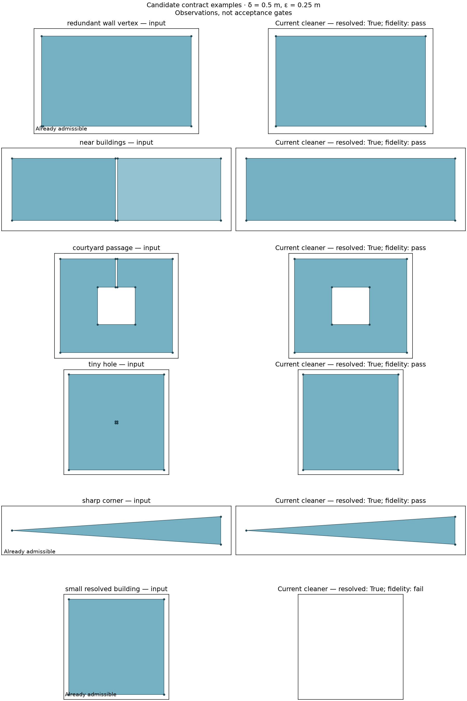

# Footprint cleaning contract

Status: adopted target contract, 17 September 2026; parameters provisional
from 18 September 2026, see "Architecture decision" below. The topology, graph
resolution and two-sided fidelity budget were agreed in the issue #104
conversation. The initial budget is epsilon = delta / 2, independently
configurable. Delta = 0.5 m and that ratio are operating defaults awaiting
re-derivation, not derived values. Area selection is a separate, explicit policy. The current cleaner
does not yet satisfy this contract on all inputs. The production policy below
separates geometric conformance from warning-only meshing continuation.

## Principle

**Cleaning finds a nearby approximation of the input that is geometrically
resolved at a declared scale.**

For interpreted input coverage P and output coverage Q:

```text
Admissibility: Q belongs to A_delta.
Fidelity:     P eroded by epsilon ⊆ Q ⊆ P dilated by epsilon.
```

These are separate obligations. Admissibility prevents unresolved output;
fidelity prevents obtaining admissibility by destroying useful input. A cleaner
returns a conforming result or explicitly reports that the requirements could
not be met. A globally optimal approximation is not required.

This makes the earlier abstract `d(P, Q) <= epsilon` concrete as a bound on where
occupied/unoccupied space may change. It is not a Hausdorff-distance bound on
boundaries: removing a tiny hole can legitimately remove its entire boundary.

## Objects and parameters

Work in a declared planar coordinate system with distance units. A footprint
coverage is a finite collection of polygonal regions, with holes. Its occupied
set is their union; its complement is open ground, including courtyards. The
contract concerns this 2D occupancy and its subdivision, not roofs or terrain.

| Parameter | Meaning |
| --- | --- |
| delta > 0 | Minimum separation of distinct geometric features in the output |
| epsilon >= 0 | Permitted thickness of the input boundary band where occupancy may change |
| eta | Declared numerical uncertainty, small relative to delta; not permission for physical alteration |
| h | Requested mesh spacing, owned by meshing rather than cleaning |

Delta and epsilon are independent. Increasing mesh refinement must not silently
change either. A requested pair of values may be infeasible. Numerical tolerance
must be fixed before cleaning, not inferred from which repair branches happened
to run or which output they managed to produce.

The contract begins with an interpreted occupied set P. For valid raw polygons,
P is their union. Initially, invalid polygonal data uses GEOS `make_valid`,
retaining its polygonal parts and reporting the count of non-area remnants.
The checker reports how many input geometries required this interpretation;
unsupported and nonfinite input fails clearly. This convention does not recover
the unknown intended meaning of arbitrary self-intersecting rings.

## Admissibility: a resolved planar subdivision

First define the geometric object, then its resolution. For this
building-footprint profile, Q has pairwise interior-disjoint valid polygonal
regions. The boundary of occupied space consists of disjoint simple closed
curves. This permits shared building edges and ordinary parcel junctions but
excludes occupied components kissing at a single point, and courtyard boundaries
touching exterior boundaries. It is the adopted topology policy for buildings,
not a claim that every planar triangulator must reject a point junction.

Construct the embedded straight-line graph G of all region boundaries:

1. Represent shared boundary pieces once and node their junctions consistently.
2. Retain bends and junctions; suppress redundant degree-two collinear vertices.
   This changes the representation, not the occupied set or region labels.
3. Let V be its vertices and E its straight segments.

Define the graph's separation by one distance rule:

```text
rho(G) = minimum of
    distance(v, w) for distinct vertices v and w,
    distance(v, e) for vertices v not incident to segment e.

Q belongs to A_delta exactly when it has the topology above and rho(G) >= delta.
```

The minimum for an empty graph is infinity. Empty output is admissible, but is
still subject to fidelity. In a planar noncrossing segment graph, the closest
points of two disjoint segments include an endpoint, so a separate segment-pair
distance rule is unnecessary.

This single separation rule covers short essential edges, close boundaries,
small holes and narrow passages. Exact shared features are incident, not
arbitrarily small gaps. Dense collinear sampling is not a geometric feature and
must not make an otherwise resolved wall inadmissible. Nearly collinear bends
remain real features unless cleaning changes them within the fidelity budget.

Distances between incident edges near their common vertex are intentionally
excluded: those distances tend to zero even at an ordinary square corner. Thus
rho is a finite-feature separation, **not a claim that every local wedge has
width delta**, and it does not impose an angular bound. A long sharp triangle
can be admissible. Preserving that corner can constrain attainable mesh angles.

The independent checker compares distances with `delta - delta * 1e-6`.
Exact collinearity is evaluated in floating-point arithmetic. Fidelity uses
32-segment-per-quadrant circular buffers and reports `borderline` when a wider
than chord-error band cannot distinguish pass from fail. The band is
`epsilon * (sec(pi / 128) - 1) + 1e-7` in coordinate units; residual difference
areas up to `1e-10` square units count as numerical noise. These are disclosed
numerical measurement conventions, not an exact-arithmetic certificate.

Fidelity buffers and area operations use a fixed local coordinate frame whose
origin is the lower bounding-box corner of the interpreted original occupied
union (zero for empty input). Candidates use that same frame throughout; neither
the origin nor the fidelity budget is reset after edits. This avoids losing thin
area differences merely because the data uses large map coordinates. The
interpreted input and physical tolerances are unchanged. World-coordinate views
of the bounds are available to research proposal code, but acceptance uses the
authoritative local geometry.

The retired legacy cleaner sometimes allowed a 31.25 mm grid tolerance at
delta = 0.5 m. The current constructor may propose a delta / 16 precision edit,
but the independent checker always uses the contract tolerance above. The
proposal grid is not a permission to accept off-contract output as conforming.

## Fidelity: preserve occupied and open cores

Let B_epsilon be the closed disk of radius epsilon. Erosion and dilation give
an explicit spatial budget:

```text
P_minus = P eroded by B_epsilon
P_plus  = P dilated by B_epsilon

P_minus ⊆ Q ⊆ P_plus.
```

Equivalently, away from the epsilon-neighborhood of the original boundary,
occupied space must stay occupied and open space must stay open. Interpret
boundary-only differences with the agreed numerical convention.

This protects both a building's interior and a courtyard's interior. A narrow
passage may close if it has no protected open core; a substantial courtyard
behind that passage must remain open. A component without a protected occupied
core may disappear. Deleting an isolated 3 × 3 m building at epsilon = 0.25 m
is forbidden regardless of how small its area is relative to the whole city.

The budget does not mandate a particular repair. Bridging a narrow gap, moving
boundaries apart or retaining a shared boundary must all be assessed against
admissibility and fidelity together. If none can meet both, report failure.
Prefer retaining already admissible input rather than making gratuitous changes;
there is no requirement to solve a global minimum-change optimisation problem.

An independent `min_area` filter is not implied by this contract. If removing
otherwise resolved buildings is desired, make it an explicit selection policy
and account for those removals separately against the original raw data. Do not
reinterpret repair failure as permission to drop geometry, or silently exclude
unwanted geometry from the fidelity reference.

## What this promises to the mesher

The contract provides a well-defined planar subdivision with a declared
separation between nonincident features. Check that the actual graph handed to
the mesher preserves that geometry under its coordinate tolerance. Source IDs
and many-to-many attribution remain part of the result's data contract.

This is not a universal triangle-angle or tetrahedron-quality guarantee.
Preserved sharp corners, domain clipping, terrain slopes and roof heights impose
additional constraints. The mesher owns refinement and quality reporting;
clipping owns validation of the new geometry it creates. A poor mesh of admissible
input is evidence to investigate the mesher or the sufficiency of its declared
preconditions, rather than automatically adding another cleaning operator.

### Mesher-input incident-sector profile (decision, 19 September 2026)

The original occupancy contract above is unchanged. Production flat and surface
meshing additionally require a **mesher-input profile**, checked by the same
independent geometry module. This is a handoff requirement, not a redefinition of
`A_delta` and not a universal triangle-angle guarantee.

For each vertex of the canonical straight-line subdivision, sort the rays of its
incident edges by polar angle. Consecutive rays, including the cyclic last/first
pair, bound the incident face sectors. Their angles are in degrees in `(0, 360]`.
Classify each sector from the labelled subdivision as occupied or open; a shared
source wall therefore retains both adjacent labelled sectors even when both are
occupied. Holes, exterior boundaries, junctions and shared walls use this same
definition. An unsigned turn from one arbitrarily oriented ring is not the
definition.

The current city-meshing profile rejects a sector below **1 degree**, with a
fixed `1e-6` degree comparison tolerance, and reports the minimum sector and a
bounded witness. Fixed fallback selection uses **3 degrees** as a thresholded
quality preference after mandatory geometry/profile checks. It does not optimize
angles above that target. These two values have different meanings: the 1 degree
gate excludes the two audited catastrophic cusp outputs (0.157 and 0.652 degrees),
while the 3 degree preference is supported only by the controlled wedge cost/
quality observations. Neither is the requested 25 degree mesh angle, and neither
promises that generated triangles attain 1, 3 or 25 degrees.

The profile is checked again on the actual labelled polygons after domain
clipping/subdivision. Geometry created at that boundary gets no new fidelity
budget. An uncertain or sub-threshold sector is a failed handoff, never a warning
that is silently meshed.

If an entire connected input component has no occupied core after erosion by the
unchanged epsilon, the occupancy contract permits its removal. Production uses
that permission only when no fixed conforming/profile-safe candidate preserves
the component: removal is deterministic, is recorded as
`empty_protected_core`, and retains the affected source IDs and area in the
cleaning result and saved artifact. It cannot remove another part of the same
source that intersects the protected occupied core, and it cannot be used to
hide a protected open core. Components with protected occupied or open cores
must be repaired within the original budget or reported unresolved.

**Uniform delta = 0.5 m is an operating choice, not an established mesher
precondition.** Controlled examples show that the pinned mesher can mesh much
smaller features, sometimes with substantial element growth. Sharp input angles
remain a separate issue that graph separation does not bound. The original
thin-passage experiment had width 1+s rather than s; its threshold claims and
the subsequent nearest-feature cost derivation are withdrawn. Neither those
experiments nor a finite corrected sweep derive a universal delta. See
[the correction report](footprint-cleaning-staged-corrections.md) for current
evidence. The geometric contract and its numerical tolerances are unchanged.

## Small examples and observations

The [probe](../../sandbox/cleaning_contract_probe.py) calls the existing final
`build_conditioned_footprints` stage, including its current normalization. It
uses the current defaults: delta = 0.5 m, merge tolerance = 0.5 m and minimum
building area = 15 m². The fidelity budget is
epsilon = 0.25 m, now the adopted initial delta / 2 default. These historical measurements
precede the courtyard fix below. The current probe disables area selection and
all six examples pass; in particular, cleaning now retains the 3 × 3 m building.

| Input | Candidate input | Current output | Candidate output | Fidelity |
| --- | --- | --- | --- | --- |
| Rectangle with an extra vertex 0.1 m along a straight wall | Admissible after canonical representation | Same occupied geometry | Admissible | Pass |
| Two buildings separated by 0.2 m | Unresolved gap | Merged; 1.20 m² added | Admissible | Pass |
| Courtyard with a 0.2 m entrance | Unresolved passage | Entrance closed; courtyard retained; 0.60 m² added | Admissible | Pass |
| Building containing a 0.2 × 0.2 m hole | Unresolved hole | Hole filled; 0.04 m² added | Admissible | Pass |
| Long triangle with a roughly 7.6° tip | Admissible | Unchanged | Admissible | Pass |
| Isolated 3 × 3 m building | Admissible | Deleted by the 15 m² filter | Empty, hence admissible | **Fail: 6.25 m² protected interior lost** |



These are examples of the general rules, not six additional acceptance clauses.
The last example demonstrates why admissibility alone is insufficient. Filling
the tiny hole also illustrates why a boundary-displacement statistic can be
misleading: its reported Hausdorff displacement is 4.9 m, yet no protected open
core is lost under this spatial budget.

The [city observations](footprint-cleaning-contract-observations.md) inspect the
saved ten-city quick run. They distinguish nominal feature separation, existing
grid tolerance, and fidelity. Those initial observations preceded the courtyard fix; the follow-up section
records its results. These observations are historical; the production gates
and warning policy are specified below.

## Implementation and migration

One authoritative checker lives in
`dtcc_core/builder/cleaning/contract.py`. `check_cleaning_contract(raw, cleaned,
delta=..., epsilon=...)` reports admissibility and fidelity separately. Omit
epsilon to use delta / 2. A numerical borderline result is not a pass. The
sandbox illustration script imports these checks rather than defining its own.

New benchmark cleaning results store this report as `geometric_contract`; the
cleaning table shows `Resolved` and `Fidelity` alongside execution status. Older
saved results are not relabeled. The existing `contract` field and execution
status describe pipeline readiness, including explicit warning continuation,
not satisfaction of the geometric target.

The production constructor now admits every candidate against one
`FidelityBudget` prepared from the interpreted original input. It does not
rebase the reference after an edit, and numerical borderline results are not
passes. Components may be removed only through the profile's explicit
`empty_protected_core` policy; ordinary cleaning cannot silently discard a
protected occupied or open core.

Area selection is now an explicit operation:

```python
from dtcc_core.builder.cleaning import (
    ConditioningOptions, condition_polygon_coverage, select_footprints,
)

cleaned = condition_polygon_coverage(
    raw_polygons,
    options=ConditioningOptions(min_feature_size=0.5, fidelity_tolerance=0.25),
)
selected = select_footprints(cleaned, min_area=15.0)  # optional
```

`ConditioningOptions` no longer accepts `min_area`. Direct callers move that
argument to `select_footprints`; dataset `min_building_area` parameters still
compose cleaning and post-cleaning selection automatically. Selection returns a
new result, keeps source indices in the original input's index space, and reports
excluded count, area, per-region source maps and now-unrepresented sources.
It neither absorbs small regions into neighbours nor changes repair ranking.
The cleaning reference is never reduced to hide intentional exclusions.

Cleaning, selection and handoff are three separately named results:

1. `before_selection_contract` compares the cleaned occupancy with the complete
   original input and includes the mesher-input profile.
2. `selection` lists every excluded cleaned region with its stable region index,
   source indices, area and reason. It also reports represented and unrepresented
   original source indices. The 15 m² default keeps its existing meaning.
3. `final_handoff_contract` validates the selected, labelled geometry actually
   sent onward. Its raw-reference fidelity remains visible and does not inherit a
   pass from step 1.

A selected-reference statistic may be reported under that explicit name, but it
does not replace raw-reference fidelity. `min_area=0` retains every eligible
cleaned region. Persisted handoffs store and validate all three records rather
than reconstructing exclusions after reload.

Fixed construction fallbacks are ordered deterministically: unchanged identity
when it meets every mandatory obligation; then mandatory geometric, fidelity,
source and handoff-profile success; then whether the 3 degree quality target is
met; then smaller raw-reference symmetric difference; then canonical output WKB.
Angle is thresholded rather than maximized, and actual meshing never runs inside
candidate search.

The dense bulk proposal is the first bounded construction attempt. If it cannot
produce any accepted candidate, the next fixed fallback preserves the
unsimplified input so that bulk simplification cannot consume the boundary-motion
headroom needed by a later repair. Once an accepted candidate exists, exact
canonical preprocessing equivalence may skip duplicate attempts. Reports retain
both selected-attempt work and total fallback work; unresolved results select the
smallest residual defect tuple for explanation without treating it as accepted.

Source indices always refer to the original input order. Every output region has
the sorted, nonempty set of sources with positive area support in that region;
split and merge attribution is many-to-many. Newly occupied bridge area inherits
the union of the sources on the connected repair support when merging is allowed.
With `merge_buildings=False`, a repair may not bridge distinct source regions.
Missing or ambiguous support is unresolved; nearest-source and first-source
guesses are forbidden. Shared source boundaries and the final labelled
subdivision are validated before roof/height attachment. A dataset run stops
on hard cleaning failures; separation-only failures follow the explicit warning
policy below. It never silently returns a partial city.

The production constructor uses a fixed, bounded family: a dense proposal,
unsimplified rescue when needed, and deterministic ranking under the independent
geometry, original-reference fidelity, source and handoff checks. Failure to
find an admitted result is a typed unresolved outcome with group/source IDs and
bounded work accounting. There is no legacy fallback and no second repair or
fidelity budget at the mesher boundary.

The high-level meshing adapter checks the final constructed geometry **before**
area selection and records `before_selection_contract` plus `selection`.
Benchmark `Resolved` and `Fidelity` columns use that cleaning-only report;
`Selected out` displays the explicit exclusions. Raw-to-selected total changes
and the selected handoff's `geometric_contract` remain in the JSON, so selection
cannot disguise geometric damage. The saved handoff remains exactly what is
passed to the mesher, after selection.

The target contract remains the definition of geometric conformance, but minimum
separation alone is **not a mesher safety precondition**. As of 20 September 2026,
the pipeline defaults to warning and attempting meshing when bounded construction
leaves only separation defects. It still prefers any fully conforming fixed
fallback. Otherwise it selects a terminal candidate by the existing defect tuple
and canonical geometry tie-break, requiring valid topology, a passing independent
original-reference fidelity check (not borderline), source attribution, and the
mandatory incident-sector profile. The assembled coverage is checked again.
No fidelity budget, search budget or delta is relaxed.

Such a result is reported as `warning`, never as conforming: the independent
`before_selection_contract` remains `fail`, with the residual pair count, minimum
separation and witness. A prominent warning is emitted even when progress logging
is disabled, and the pipeline stage and benchmark retain warning status through
selection and saved-stage replay. Smaller mesh elements and increased mesh cost
are possible; meshing success is not guaranteed. The public conditioning option
`allow_residual_separation=False` retains strict conformance-only behavior.

The actual labelled subdivision is validated again after clipping and before
meshing; invalid topology, incident sectors and segment graphs still reject, and
the complete building/ground/domain handoff is mandatory. Adapter validation may
reject but never repair. The consumer permits the cleaner's explicit warning
state; this does not silently waive new separation failures introduced by
clipping a previously conforming input. The superseded legacy constructor and
mesher-side normalization were removed after the full flat/surface acceptance evidence in
`footprint-cleaning-production-evidence.md` was recorded. Frozen audit artifacts,
not a second runtime implementation, retain the old comparison.

The [pipeline design](footprint-cleaning-pipeline.md) records the construction
rationale and why offsets, snapping and independent repair passes are not
sufficient. It is supporting design history, not an additional contract.

## Architecture decision

Recorded 18 September 2026 from the measurements of
[the feasibility and architecture plan](../../.agent/plans/2026-09-18-footprint-cleaning-feasibility-and-architecture-decision.md),
which holds the evidence and the limitations in full.

**The contract's structure and the current construction architecture are both
retained. The contract's parameters are re-derived from measured evidence.**

Correction (19 September): this is the historical decision, not evidence that
parameters have been derived. The later staged construction reaches more groups
at the unchanged defaults. The wall-cost extrapolation and thin-passage
calibration were invalid; see the active plan and correction report. No change
to delta or epsilon is authorised by those withdrawn arguments.


The three measurements that forced it:

- A declared control — GEOS topology-preserving simplification at one global
  tolerance, then canonicalization — reaches 336 of 538 corpus groups in 0.82
  seconds, against the current construction's 507 in 983.86. The architecture is
  not replaced, because nothing measured beats it, and the descent's accepted
  edits grow as the 1.19 power of canonical vertex count, below the threshold
  fixed in advance for disqualifying it. Its runtime grows as the 2.39 power,
  because work per edit and not the number of edits is what scales.
- Uniform delta = 0.5 m exceeds the measured mesher precondition by a factor
  between 100 and 5,000, as the section above records. It is not derived from a
  precondition and cannot be justified as one. Delta is to be re-derived from a
  declared mesh-element budget and recorded as the cost decision it is.

  Measured, 19 September 2026: the mesh side of that budget is now recorded in
  [the measured cost curve](footprint-cleaning-delta-cost.md), which replaces
  the withdrawn model with direct meshing. Lowering the floor from 0.5 m to
  0.1 m costs 1.75 times the elements; a 10% overhead budget points at 0.43 m.
  No parameter is changed here: the fidelity cost of a *larger* floor is still
  unmeasured, and a floor policy needs both halves of that trade.
- Epsilon = delta / 2 is not exonerated. A fixed ladder of 57 global
  constructions witnesses 438 of 538 groups conforming at epsilon <= delta / 2,
  but only 8 of the 31 groups the construction cannot solve; the other 22 are
  witnessed at roughly delta. A sufficient epsilon cannot prove a smaller one
  impossible, so epsilon may not be changed before a lower-bound witness exists.
  See [feasibility](footprint-cleaning-feasibility.md).

A graded, local-feature-size contract was considered and not chosen: the
measurements point towards it and none of them shows it is reachable, cheaper,
or agreeable with the mesher's own graph construction. It remains the successor
if a defensible uniform delta cannot be derived.

Retired by this decision: reading the mesher section as though delta were a
precondition; treating delta = 0.5 m and epsilon = delta / 2 as justified rather
than provisional; and any prospect of a global simplify or snap-rounding stage
as the production cleaner, which as a preprocessing stage remains open. The
construction record is not retired.

This document owns the contract. The [review](footprint-cleaning-review.md)
records history, the [plan](../../.agent/plans/2026-09-17-footprint-cleaning-consolidation.md)
tracks earlier implementation, the
[feasibility and architecture plan](../../.agent/plans/2026-09-18-footprint-cleaning-feasibility-and-architecture-decision.md)
holds the measurements behind the decision above, and the
[benchmark guide](../../benchmarks/README.md) explains operation.
