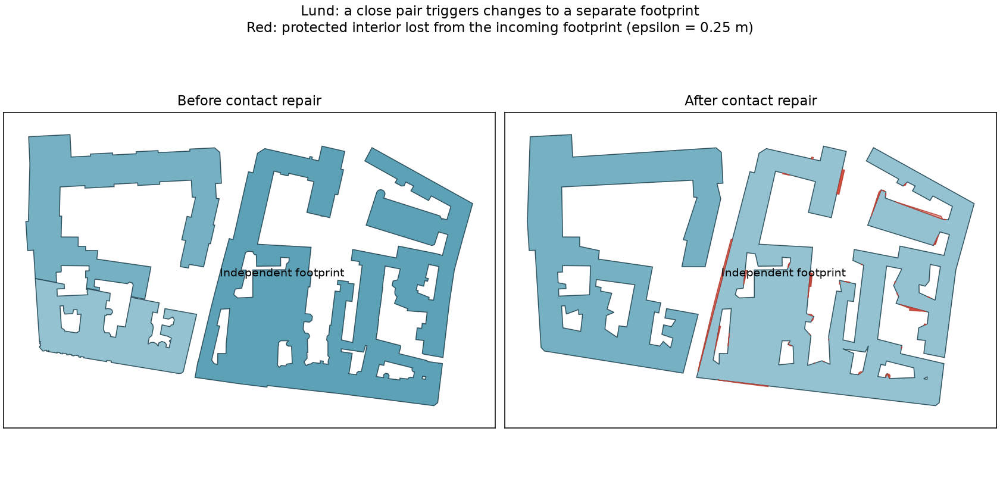
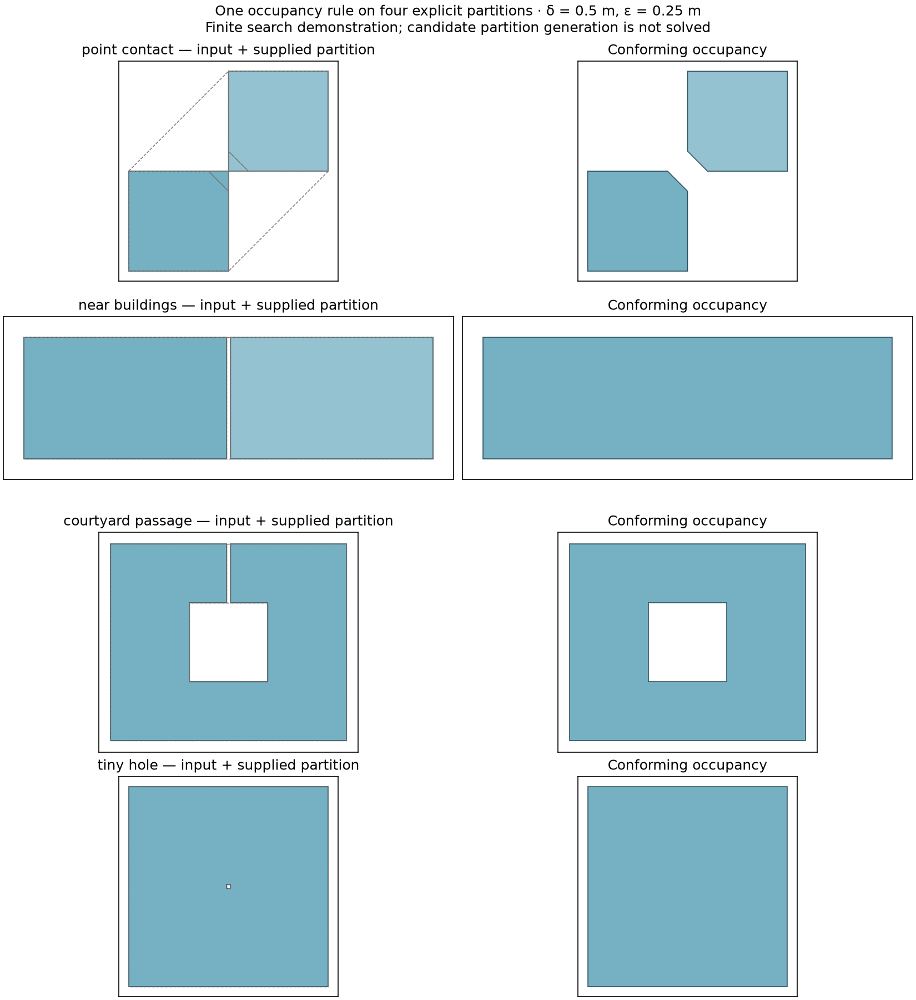
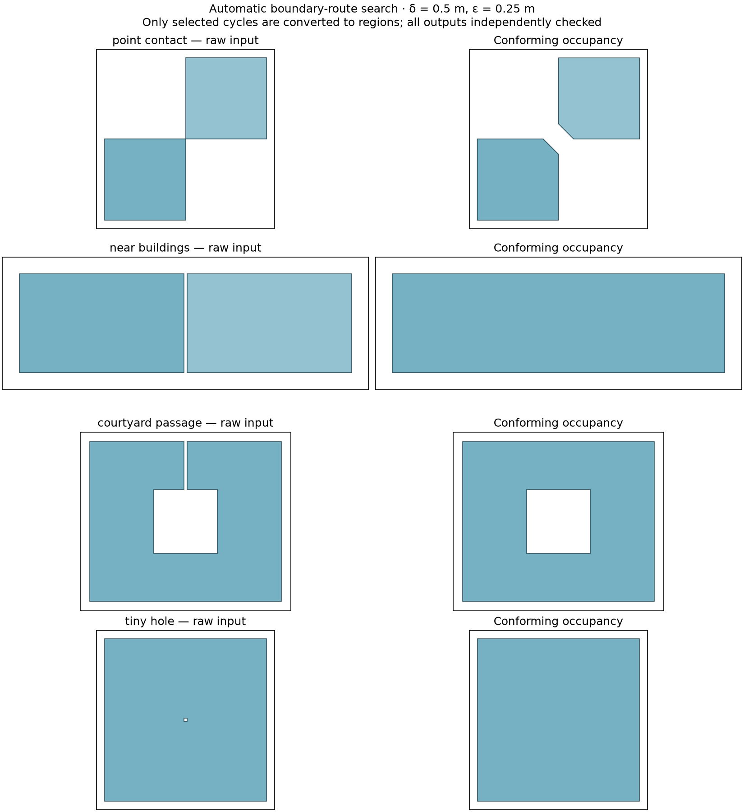
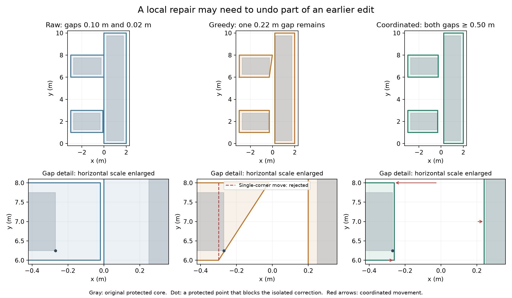
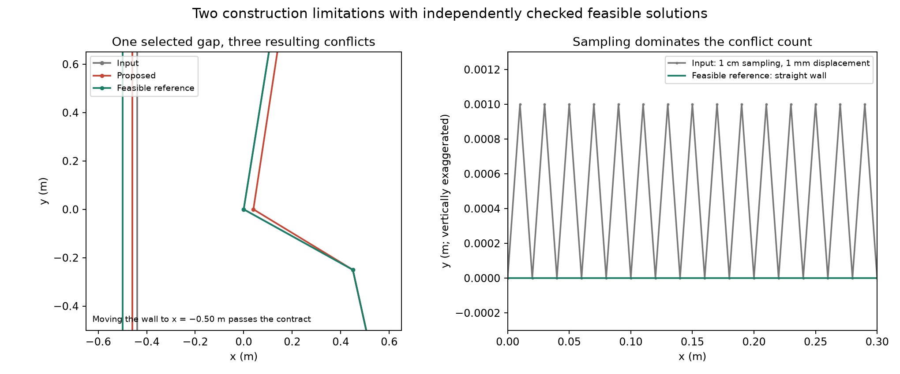

# A contract-directed cleaning pipeline

Status: design direction and bounded implementation proposal, 17 September 2026.
This follows the user's explicit instruction to avoid further case-by-case repair
accumulation. The [adopted contract](footprint-cleaning-contract.md) remains the
behavioral authority. This document does not claim a complete solver or change
production cleaning. There is one active [implementation plan](../../.agent/plans/2026-09-17-footprint-cleaning-consolidation.md).

The current constructive candidate proposes local occupancy changes and coordinate
displacements together, accepting only edits within the original fidelity budget
that strictly decrease an integer defect tuple. See the
[construction and progress argument](#constructive-patch-experiment-17-september-2026)
and its [coordinate freedom](#necessary-coordinate-freedom). The earlier models
below record research evidence; they are not additional stages or fallbacks in
this construction. Production integration still requires remaining city cases,
source semantics, and broader mesh evidence.

## Formulate one geometric problem

Interpret the input once, obtaining occupied space P and its source attribution.
Construct fixed sets L = P eroded by epsilon and U = P dilated by epsilon. Then
seek a polygonal subdivision Q satisfying both requirements simultaneously:

```text
L ⊆ occupied(Q) ⊆ U
Q belongs to A_delta
```

L is compulsory occupied space, the complement of U is compulsory open space,
and U minus L is the only space in which occupancy can be decided. Internal
source walls are part of the subdivision, not exterior boundaries of P.

This is a constrained geometric construction, not an instruction to apply a
sequence of independent cleanup filters. Minimize unnecessary changes within
the feasible class; a global optimum is not required. Returning already
admissible input unchanged is the simplest successful case.

A search that cannot find Q must report unresolved constraints. That is different
from proving that no feasible Q exists. Neither case licenses deleting a building,
filling a protected courtyard, widening epsilon, or silently returning a result
that fails the contract. Numerical borderline cases remain unresolved.

## What the Lund case establishes

The previous opening experiments changed which later repair paths ran. A saved
contact-stage input can now reproduce the amplification using just three
polygons, with their original source geometry retained in
[`lund-contact-coupling.geojson`](../../tests/data/cleaning/lund-contact-coupling.geojson).
The fixture has two close footprints and a third at least 6.14 m from either.
It contains intermediate geometry and 55 associated raw source polygons; the
original source groups are at least 6.02 m apart. It is not presented as a new
raw-city acceptance tile.

When the contact routine receives only the third footprint, it leaves it
unchanged. Adding the distant close pair triggers whole-coverage postprocessing
and removes 122.13 m² of the third footprint's protected incoming interior.
Against that footprint's original raw sources, protected loss rises from
0.0114 to 121.38 m². The three-polygon subset has different neighbors from the
full city, so its total changes need not equal the full-city trace.

The responsible control flow is structural: after resolving a contact,
`_regularize_coverage_contacts` can run polygon simplification and clearance
regularization over the entire coverage, then select that candidate using a
legacy defect score. A local trigger can therefore change an independent block.
This does not justify another shape-specific exception inside that routine.



The red overlay measures loss relative to the incoming stage footprint, not a
replacement of the original fidelity reference. The probe separately reports
both measurements. No output from this failing experiment is a golden expected
cleaning result.

## Safe decomposition follows from the contract

For two input groups P_i and P_j, any faithful outputs lie within their original
epsilon dilations. By the triangle inequality:

```text
distance(Q_i, Q_j) ≥ distance(P_i, P_j) - 2 epsilon.
```

Consequently, when distance(P_i, P_j) > 2 epsilon + delta, those groups can be
solved independently: no allowed choice of output geometry in one can create a
sub-delta feature distance to the other. Occupied cores also decompose across
these positively separated groups. Their outputs cannot cross or touch.

A conservative partition is the connected components of the graph joining
original input parts whose distance is at most 2 epsilon + delta. Nearby groups
may still admit finer decomposition; this rule provides a sufficient condition,
not an assertion that every connected group must merge. Use the declared
numerical margin conservatively when computing the partition.

At epsilon = 0.25 m and delta = 0.5 m, the interaction distance is 1 m. It is
mathematically derived, not another fitted cleanup parameter. Lund's third
footprint is well beyond that distance in the reduced example. Locality here
is an implementation consequence we can use, not a new seventh contract clause.
Merging permission, source attribution and required internal region boundaries
still apply within each group.

## Three attractive shortcuts are insufficient

The executable [probe](../../sandbox/cleaning_pipeline_probe.py) uses the existing
independent checker to demonstrate these limitations. None requires a city-specific
threshold or operator.

**Opening and closing can bound occupancy change, but not polygonal resolution.**
For exact Euclidean disk morphology with radius r ≤ epsilon, let
O = (P eroded by r) dilated by r and Q = (O dilated by r) eroded by r. Then:

```text
P eroded by r ⊆ O ⊆ P
O ⊆ Q ⊆ O dilated by r ⊆ P dilated by r.
```

Thus the two operations together satisfy the spatial sandwich in exact set
arithmetic. This argument concerns the union P, not independent building rings.
It establishes no lower bound on distances in Q's polygonal boundary graph.
For example, round-buffer opening/closing of a square creates many short arc
segments: the probe passes fidelity but has graph separation about 0.00245 m
at delta = 0.5 m. Blanket morphology also changes already admissible input.

This proof cannot be transferred unchanged to the current mitred, snapped
operators. Shapely distinguishes circular-arc approximation from mitre joins;
its outputs are polygonal approximations. Numerical implementation still needs
independent verification. [Shapely buffer documentation](https://shapely.readthedocs.io/en/stable/reference/shapely.buffer.html)

**A coordinate grid does not imply graph separation.** All vertices of the
triangle (0,0), (10,1), (1,0) lie on the unit grid, but the last vertex is only
1/sqrt(101), approximately 0.0995 m, from the opposite edge. Minimum edge length
or vertex spacing cannot replace the nonincident vertex/edge constraint.

Iterated snap rounding does provide a vertex/nonincident-edge separation bound
of half a pixel width, with an approximation tradeoff. To obtain delta from that
bound alone requires pixel width at least 2 delta; even initial pixel rounding
can move a point by pixel_width/sqrt(2), which exceeds epsilon = delta/2 in the
worst case. This does not prove that particular inputs cannot pass; it rules out
using that guarantee alone as our complete solution. It also does not settle
our occupied-boundary topology and source-label requirements. No CGAL dependency
is proposed. [CGAL snap rounding manual](https://doc.cgal.org/latest/Snap_rounding_2/index.html)

**Clipping back to the fidelity band can undo resolution.** The projection
R = (Q intersect U) union L restores the occupancy sandwich, but can introduce
short edges and close boundaries. The probe starts with two rectangles separated
by 0.6 m and a merged rectangular candidate. Projection into a 0.2 m band
(with headroom inside epsilon = 0.25 m) produces a 0.2 m gap: fidelity passes,
resolution fails. Alternating two individually useful projections is therefore
not a demonstrated convergent cleaning algorithm.

## Proposed ownership and pipeline

```text
raw polygons + source identities
        ↓
interpret once; construct occupied union and shared planar subdivision
        ↓
fix original fidelity band; partition independent interaction groups
        ↓
construct a resolved polygonal subdivision inside that fixed band
        ↓
independent final contract check: conforming result or explicit unresolved result
        ↓
optional area selection → the same geometry for plotting and meshing
```

The construction stage owns all changes to footprint XY. It must solve topology,
feature separation and fidelity together, rather than let a later recovery or
mesher-preparation pass invalidate an earlier decision. Meshing still validates
its inputs. Domain clipping, terrain and roof geometry remain separate meshing
responsibilities; clipping must validate the new geometry it creates.

Represent shared edges once. Source attribution is attached to regions and
carried through permitted merges/splits; it is not reconstructed by reopening
original boundaries after cleaning. If the current merge policy requires an
internal boundary, removing it is not a free simplification. For now preserve
existing public option semantics; any proposed change to those semantics needs
to be identified explicitly.

The output check certifies only the delivered geometry under the declared
floating-point conventions. Do not claim exact arithmetic certification, or
assume a conversion to Surface, a default simplification, or precision snapping
leaves that geometry unchanged. Area selection is already a separate operation.

## First construction step: bounded planar-graph simplification

Start with a deliberately limited, falsifiable method: simultaneous
**topology-preserving boundary simplification inside the fixed fidelity band**.
Use the existing geometry dependencies. Operate on shared graph chains, not
independently on each polygon. Evaluate a shortcut against the original band and
all affected incident faces. Keep mandatory junctions and shared edges consistent.

Removing a degree-two bend replaces two edges by one. A prototype restricted to
such removals has a simple termination argument: every accepted edit reduces
the finite vertex count. Enumerate degree-two shortcuts adjacent to unresolved
features. Check intersections, region topology and original-band containment
before acceptance. Among admissible proposals, choose the smallest occupied
symmetric-difference area relative to the original P, breaking ties by canonical
coordinate order. This fixed greedy rule is a testable prototype choice, not a
claim of optimality or completeness. It has no per-city tuning weights.

Stop when the independent graph check passes or no permitted shortcut remains.
Measure feature separation on the resulting graph; do not infer it from a
simplification tolerance. If the remaining graph fails, report unresolved. The
same rule applies to every input, without separate notch, wedge or courtyard
heuristics.

Topology-preserving simplification of multiple polylines is an established
approach, including coordinated handling of shared subsequences. Its topology
guarantee alone is insufficient for our additional separation and occupancy
constraints. This is a method reference, not a proposed dependency or a claim
that the existing package directly solves our contract.
[CGAL polyline simplification manual](https://doc.cgal.org/latest/Polyline_simplification_2/index.html)

This restricted step cannot resolve every narrow passage, separated parallel
wall, or point contact: some need coordinate movement or topology changes.
Report those as unresolved and characterize the remaining geometric class.
Do not append a special-case fallback when a city example needs one. If the
restricted method cannot make useful progress, reconsider the construction
method itself before expanding the operator set. An explicit boundary on the
prototype prevents it becoming another permanent repair stack.

Before a more general construction is implemented, specify its allowed topology
changes and progress/termination argument. A lower legacy defect score is not
such an argument, and finite search exhaustion is not proof of infeasibility.

## Validation and adoption

Keep production on the existing implementation during this bounded design and
prototype work. No production cleaning code changed in this step. The portable
probe and stage fixture are development evidence, not a second public cleaner.
Retire the contact-stage replay when that private implementation is removed,
keeping the general locality and contract examples.

For the proposed first construction slice, require unchanged already-admissible
input, coherent shared boundaries, original-band containment after every accepted
edit, and termination. Validate the final graph independently. Use the shared-wall
example, protected courtyard, and the isolated Lund case as geometric examples,
not requirements to reproduce old branch choices. Test permutation and distant-input
independence; numerical uncertainty remains explicit.

Then replay the fixed ten-city inputs once against that fixed method, recording
conforming/unresolved counts, fidelity, runtime and the existing mesh-quality
statistics. Classify failures before making another algorithm change. Do not tune
radii or scoring weights city by city. Integrate a replacement slice only when
its measured behavior is useful and its superseded path can be removed. Keep
inspection and meshing on the same cleaned artifact throughout migration.

Reproduce the evidence in this document:

```sh
MPLCONFIGDIR=/tmp/dtcc-plot-mpl-cache XDG_CACHE_HOME=/tmp/dtcc-plot-cache \
  .venv/bin/python sandbox/cleaning_pipeline_probe.py --output /tmp/pipeline-probe
.venv/bin/python -m pytest -q tests/builder/test_cleaning_contract.py
```

The three analytic counterexamples pass fidelity and fail graph resolution as
expected. The Lund replay is observational and intentionally does not assert
that today's damaging output must be preserved. No new end-to-end fidelity or
mesh-quality improvement is claimed by this design step.

Verification for this step: the probe completed and its missing `--output` error
returned exit code 2; the generated figure was visually inspected; all 15 focused
contract tests passed; and `git diff --check` passed. The original source groups'
minimum distance (6.02 m) was checked as well as the stage-input distance (6.14 m).
No city mesh rerun was needed because production geometry code was not changed.


## Bounded prototype results

The vertex-removal prototype is implemented in
[`sandbox/cleaning_graph_prototype.py`](../../sandbox/cleaning_graph_prototype.py).
It has no production callers and uses the independent contract checker. Input
linework is noded into a shared subdivision with source labels. Where the
existing `merge_buildings` policy allows it, input normalization dissolves
internal walls of already-connected occupied coverage; this changes subdivision,
not occupancy. Refinement never joins separated components or deletes a hole.
With merging disabled, shared walls and their incident faces are maintained.
The fidelity bound concerns occupancy, not an additional per-source displacement
guarantee for internal walls.

Each candidate removes one degree-two vertex and updates all incident faces.
It is rejected if the new chord crosses existing edges, the swept triangle
contains another graph vertex, a face/ring would become invalid, or the fixed
original fidelity band would be violated. Testing the swept triangle is necessary:
a shortcut can swallow an entire island without crossing its boundary. Exact
collinear representation cleanup is included in the proposed geometry before
admission. Candidate ordering uses original occupied symmetric-difference area,
then vertex coordinates, as specified above.

Accepted edits strictly reduce the canonical vertex count. A separate fixed
work bound of 2,000 candidate checks per independent group makes the research
run practical. Reaching it reports `work_limit`; it is not a geometric tolerance
or a proof that the group cannot be resolved. A partially scanned candidate set
is not used to commit a different greedy choice. No city-specific parameters
or fallback operators were added.

All ten fixed raw city tiles were evaluated with their merge policy, delta =
0.5 m, epsilon = 0.25 m and no area selection. Results and provenance are in
[`footprint-cleaning-graph-results.json`](footprint-cleaning-graph-results.json).

| Result | Groups |
| --- | ---: |
| Already resolved after input interpretation | 252 |
| Additionally resolved by the prototype | 93 |
| Unresolved: input topology needs to change | 79 |
| Unresolved: no admitted shortcut remains in the greedy search | 82 |
| Unresolved: work bound reached | 32 |
| Total independent groups | 538 |

The prototype accepted 2,193 vertex removals. **All ten city outputs pass the
original fidelity measurement, but none passes the complete contract.** Lund has
1.74e-11 m² nominal protected loss, below the checker's declared 1e-10 m² numerical
area threshold; the other nominal loss/addition measurements are zero. This is
agreement with the declared numerical check, not an exact-arithmetic proof.
The 93 newly resolved groups are useful progress; the 252 unchanged resolved
groups must not be counted as successful repairs.

The unoptimized final run took 115.77 s over all ten cities. These are single
samples and include independent checks; this is not a performance improvement
claim or an equivalent successful replacement for the production pipeline.
No full-city mesh-quality comparison was performed because every city remains
unresolved. An unresolved candidate is not handed off as accepted cleaning.

The Helsingborg courtyard fixture remains faithful, though unresolved. The
Lund raw subset likewise remains faithful, and its distant block's output is
geometrically identical with and without the triggering pair. A conforming
shared-wall example was passed directly to the existing flat-mesh builder with
legacy cleaning and mesher-ready footprint repair disabled: 145 triangles,
zero degenerates, quality p01 0.6842, using the existing pinned mesher.

Verification: eight focused prototype tests and fifteen independent contract
tests passed. They cover shared-wall consistency, unchanged admissible shapes,
source attribution/merge permission, the original fidelity bound, preservation
of topology, permutation/distant-input independence, finite progress, work-limit
reporting and invalid input. The ordinary example and saved-city CLI paths were
exercised. The analytic counterexamples are not changed to make this prototype
appear complete.

```sh
.venv/bin/python -m pytest -q tests/builder/test_cleaning_graph_prototype.py tests/builder/test_cleaning_contract.py
.venv/bin/python sandbox/cleaning_graph_prototype.py --output /tmp/graph-examples
.venv/bin/python sandbox/cleaning_graph_prototype.py --output /tmp/graph-cities \
  --run benchmarks/runs/2026-09-17_100049_quick
```

**Decision:** retain this as a bounded construction experiment; do not integrate
it as the cleaner. Topology-preserving vertex removal alone is insufficient for
the acceptance corpus. In particular, it cannot correct initially nonmanifold
occupied boundaries while preserving their topology. The 82 stalled greedy
searches and 32 capped groups do not establish infeasibility.

**Next at that checkpoint:** specify a general topology construction from compulsory occupied/open
space and the intervening band, with an explicit termination argument and final
separation check. Start from analytic point-contact, narrow-passage and hole
examples as instances of the same occupancy decision. Do not append separate
shape-specific operators to this prototype or tune its work bound by city.
Keep production behavior unchanged until a useful replacement passes the
acceptance boundary and its superseded path can be removed.

## Topology construction as constrained occupancy selection

The next construction is a **joint choice of occupied faces in a finite planar
partition**. Topology and resolution must be decided together. It is not enough
to fix topology first and hope a later simplifier can restore separation without
leaving the original band. The executable finite search below tests this
formulation; automatic construction of a useful partition remains open.

### Mathematical model and termination

Let C be a finite embedded planar straight-line subdivision of a bounded domain
D containing the compulsory occupied set L. Its faces have disjoint interiors.
Give each face f an occupancy label x_f in {0, 1}; the exterior of D has label 0.
The candidate Q is the union of faces labeled 1. Its boundary follows the
partition, but internal edges between equal labels disappear.

In exact set arithmetic, ignoring boundary-only distinctions as in the contract:

- A face intersecting the interior of L must be occupied.
- A face containing any positive-area part outside U must be open.
- A face with both requirements proves this **partition** cannot represent a
  faithful result. It does not prove the geometric problem is infeasible.
- Every remaining face is free. All occupancy choices in the original boundary
  band use this one rule, including additions, removals, connections and splits.

Provided L is covered by D, these face constraints imply the fidelity sandwich
for every resulting union. They impose no area-selection policy, preference for
merging, or obligation to preserve the input's connectivity. A large courtyard
is protected by its compulsory open core without a special courtyard operation.

Topology can be characterized on the same embedded partition: walk the incident
face labels cyclically around a vertex, including the exterior label at D's
boundary. There must be either zero or two transitions between occupied and
open. Four or more transitions produce a nonmanifold occupied boundary. In a
finite planar embedding, requiring every active boundary vertex to have degree
two yields disjoint simple cycles. This observation does not establish the
metric separation constraint.

For separation, construct the **active canonical boundary graph**, suppressing
collinear degree-two vertices, and require rho >= delta. Requiring all vertices
of C to be separated would be wrong: unused edges and collinear sample points
are not features of Q. This is why even a fine candidate partition need not
force a finely segmented output, and why a grid alone is not the guarantee.
The implementation uses the existing independent checker for both topology
and graph separation, rather than adding a second validator here.

With m free faces there are 2^m labelings. Enumerate each at most once, checking
the delivered union against the original contract, and stop at a conforming
result or exhaustion. This is a finite termination argument; no decreasing
heuristic defect score is needed. Order choices by occupied symmetric-difference
area relative to the original P, with a deterministic tie break. Because face
interiors are disjoint, this area is a sum of per-face label costs plus a fixed
contribution outside D. The objective only orders the search; it never trades
fidelity or resolution against another preference.

This is exhaustive only over the supplied partition and the admitted numerical
labels. It is exponential, not a proposed city-scale algorithm. Exhaustion means
`carrier_search_exhausted`; a work bound means `work_limit`. Neither means that
no faithful resolved geometry exists. A failed search returns no candidate
geometry as an accepted cleaning result.

### Executable proof examples

The existing [pipeline probe](../../sandbox/cleaning_pipeline_probe.py) now has
a small `occupancy_search` oracle, capped at twelve free faces (4,096 labelings).
It validates the supplied cells, uses the existing `FidelityBudget` to classify
them, and checks every complete candidate with `check_cleaning_contract`.
Cell classification uses the same strict buffer convention and area uncertainty;
the final check also catches aggregate numerical losses from multiple cells.
No exact-arithmetic or continuous-search completeness claim is made.

Four analytic examples use explicitly supplied partitions. The point-contact
example includes two candidate corner cuts; the passage example includes a cut
across its mouth. These coordinates are declared example data, **not an
automatic proposal rule**, and the partitions are not evidence of city coverage.
The search contains no contact, passage, gap or hole-specific repair branch.

| Example | Free faces | Labelings checked | Change | Full contract |
| --- | ---: | ---: | --- | --- |
| Two squares touching at a point | 2 | 4 | Both touching corners cut; components separated | Pass |
| Two rectangles with a 0.2 m gap | 1 | 2 | Gap becomes occupied | Pass |
| Courtyard with a 0.2 m entrance | 1 | 2 | Entrance closes; courtyard remains open | Pass |
| A 0.2 × 0.2 m hole | 1 | 2 | Hole becomes occupied | Pass |

All use delta = 0.5 m and epsilon = 0.25 m, with zero measured protected loss
and zero measured addition outside the budget. The changed areas are respectively
0.16, 1.20, 0.60 and 0.04 m². Results are recorded in
[`footprint-cleaning-topology-results.json`](footprint-cleaning-topology-results.json).

The touching-square example explains the need for a joint choice. Removing a
corner triangle with legs t on just one square leaves separation t/sqrt(2).
Removing the corresponding triangle on both gives separation sqrt(2)*t, provided
the remaining long edges are not limiting. For these 2 × 2 m squares and
t = 0.4 m, one cut leaves 0.283 m while both give 0.566 m. Fidelity permits
t <= 2*epsilon because the square's eroded corner is inset by epsilon along
both axes. The two cuts therefore satisfy both requirements with slack; neither
individual change satisfies the full contract. This is an example derivation,
not a proposed corner-cut parameter for the cleaner.

Without those candidate cuts, exhaustive search of the input-edge partition
reports unresolved for the **same raw input**. The refined partition succeeds.
This directly demonstrates why failure of a finite search is not a proof of
geometric infeasibility, and identifies candidate geometry as a separate
construction obligation.



### Scope and next acceptance gate

This oracle studies **occupancy with internal walls permitted to dissolve**.
It does not implement preservation of required source boundaries, attribution
through topology changes, or a public cleaning API. Mandatory internal walls
would have to remain in the active subdivision and in its resolution check;
binary occupancy alone cannot represent those semantics. Production merge policy
and source handling are unchanged. Do not put this oracle into the production
pipeline or compose it as an extra repair after the graph prototype.

The original-reference and independence arguments remain applicable: construct
each partition from its original interaction group, and retain the same fixed
L/U throughout search. A shared global adaptive grid or neighboring result must
not change an independently solvable group's candidate geometry.

**Next:** define and evaluate one automatic, geometry-derived candidate partition
for an interaction group. It must represent unchanged input and offer alternative
boundary routes within the original band. Demonstrate that these routes arise
from the same construction on the analytic examples, rather than inserting
example-specific cuts. Measure partition size and free choices on the fixed raw
city groups before selecting a faster solver or adding dependencies. A smaller
search space is useful only if it still contains conforming results.

The fixed-city prototype results from the preceding step are unchanged. There
is no new city or mesh-quality claim from these supplied partitions. Integration
still requires useful fixed-corpus results, source/subdivision semantics, and
removal of the superseded production path.

Reproduce the search, the earlier counterexamples and both figures:

```sh
MPLCONFIGDIR=/tmp/dtcc-plot-mpl-cache XDG_CACHE_HOME=/tmp/dtcc-plot-cache \
  .venv/bin/python sandbox/cleaning_pipeline_probe.py --output /tmp/topology-probe
.venv/bin/python -m pytest -q tests/builder/test_cleaning_topology_search.py tests/builder/test_cleaning_contract.py
```

## Automatic candidate generation: local chords

The next experiment implements one automatic construction in the existing
pipeline probe. It receives an original interaction group, never an example's
hand-specified cuts. Required source walls remain outside this occupancy-only
experiment. No production cleaning code or dependency changed.

The fixed rule is:

1. Interpret the original occupied union P and canonicalize its boundary graph.
   If it is already resolved, retain its input partition without proposals.
2. For every vertex, project onto each boundary segment within
   R = 2*epsilon + delta. Sample that segment at epsilon/2 intervals on either
   side of the projection, retaining samples within R of the vertex and all
   original vertices. There is no world-coordinate grid or feature-type branch.
3. Join every pair of sites within R when their chord is covered by the strict
   original free band, omitting chords already covered by the original boundary.
4. Node the original boundary, the group's convex-hull boundary and these chords;
   polygonize their arrangement. Classify its cells with the existing oracle.

The original boundary remains available in exact arithmetic. Each new candidate
edge lies in the measured free band; that does not by itself make every labeling
faithful or resolved. The same final checker remains necessary. The convex-hull
domain also restricts outward changes, so this family is not complete.

The half-epsilon sampling and chord-length ceiling are fixed research choices,
not additional contract parameters or a theorem of approximation completeness.
R reuses the interaction scale, but the independence proof does not prove that
all useful boundary routes are chords of length at most R. No radius, sampling
spacing or tolerance was tuned by example or city.

Finite input and finite sampling give finitely many sites and chords. The probe
caps each group at 2,000 sites, 2,000 chords and 20,000 cells. Crossing a cap
returns no partial carrier; counts recorded there may be lower bounds, not full
construction sizes. Zero epsilon admits only the input partition. An unrepresentable
sampling step is reported explicitly. These are research work bounds, not proof
of infeasibility or permission to modify geometry.

### Representation succeeds on the analytic examples

All four automatically generated partitions reconstruct their original inputs
with zero symmetric-difference area. Each also contains a conforming alternative
that can be reconstructed exactly from its cells. Witnesses are applied only
after candidate generation, as a coverage check; they are not passed into it.
The point-contact witness uses corner legs of 0.375 m, one of the automatically
sampled lengths, giving separation sqrt(2)*0.375 > 0.5 m and staying inside the
0.25 m fidelity bound. The other three reuse the previous analytic witnesses.

| Example | Sites | Chords | Cells | Free cells |
| --- | ---: | ---: | ---: | ---: |
| Point contact | 127 | 290 | 2,414 | 2,410 |
| Narrow gap | 136 | 568 | 10,969 | 10,967 |
| Courtyard entrance | 204 | 692 | 12,165 | 12,163 |
| Tiny hole | 80 | 158 | 1,337 | 1,336 |

These are representation successes, **not successful automatic searches**.
The exhaustive oracle remains capped at twelve free cells; it was not expanded
to search these partitions. Even a two-rectangle example produces thousands of
binary decisions, mostly caused by intersections between alternative routes.
Pairs of chords can intersect, so the cell count can grow quadratically in the
number of proposed chords before any actual output boundary has been selected.

### Fixed-city measurements reject eager arrangement construction

The same fixed rule was measured on all ten saved raw city tiles, using their
existing 1 m interaction grouping at delta = 0.5 m and epsilon = 0.25 m. All
cases permit merging. No data was downloaded and no city-specific cut was added.

| Outcome | Groups |
| --- | ---: |
| Already resolved; input partition retained | 252 |
| Site cap reached | 29 |
| Chord cap reached | 204 |
| Cell cap reached | 16 |
| Generated partition fails cell validation | 37 |
| Total | 538 |

Thus **none of the 286 groups needing changes produced a valid, uncapped carrier
ready for search**. There are no city search or new meshing results from this
experiment. The measured per-group construction/classification time summed to
44.99 s; this excludes saved-input loading and grouping and is a single run, not
a cleaner performance comparison.

The invalid-cell failures are concrete, not inferred from small feature sizes.
For example, Lund group 23 produces 8,002 cells, of which 26 are invalid. GEOS
reports self-intersections in thin cells with areas around 2.6e-12 and 6.7e-12 m².
This is evidence of numerical fragility in densely noded linework at the source
coordinates; it does not establish a particular GEOS defect or make those cells
valid. No precision snapping, tiny-cell deletion or relaxed validity rule was
introduced. Fixing these cells alone would leave the combinatorial problem.

Source identity, case bounds, caps, per-city counts, the invalid-cell example and
analytic reports are in
[`footprint-cleaning-carrier-results.json`](footprint-cleaning-carrier-results.json).
Detailed group reports are emitted by the reproducible command below. Cell
validation checks validity and disjoint interiors; it does not apply the output
resolution requirement to artificial subdivision cells. Output geometry still
uses the complete independent contract checker.

### Decision and next step

**Do not integrate eager all-chord arrangements or raise the search limit.**
This fixed construction provides useful candidate routes on the analytic inputs,
but fails the city construction gate. That conclusion applies to this candidate
family and numerical implementation, not to every possible constrained solver.

Next, keep boundary routes as alternatives and select compatible routes before
forming their regions. Crossings between mutually exclusive proposals should not
become thousands of independent occupancy cells. Specify the joint cycle,
noncrossing, fidelity and canonical-separation obligations first, then test a
bounded search using the same examples and original groups. Preserve explicit
unresolved outcomes and the original fidelity reference. Do not add a contact,
hole or city-specific repair path.

The relevant length rule remains the one on the **selected canonical graph**.
Simply forbidding every candidate edge shorter than delta would be wrong: the
0.2 m chord bridging the top of the rectangle gap becomes part of a long straight
boundary after the intervening collinear vertices disappear. Internal source
walls and attribution still need a separate, explicit integration decision.

Verification: 31 focused tests pass, including automatic representation,
unchanged resolved geometry, input-order independence, explicit work limits and
the previous topology/graph/contract checks. The ordinary probe and saved-city
invocation completed. Production behavior and prior mesher evidence are unchanged.

```sh
MPLCONFIGDIR=/tmp/dtcc-plot-mpl-cache XDG_CACHE_HOME=/tmp/dtcc-plot-cache \
  .venv/bin/python sandbox/cleaning_pipeline_probe.py --output /tmp/carrier-probe \
  --run benchmarks/runs/2026-09-17_100049_quick
```

## Selecting boundary routes before constructing regions

The [route probe](../../sandbox/cleaning_route_probe.py) now solves a bounded
joint selection problem over the same automatically generated boundary sites
and chords. Candidate generation is shared with the preceding experiment;
it retains the same 2,000-site and 2,000-chord caps. It never constructs the
arrangement of all alternatives and never receives the example-specific cuts.
Only selected cycles become polygons. This is an occupancy research model,
not a public cleaner or an implementation of mandatory internal source walls.

### Model, progress and admission

Each candidate segment has two directed binary choices. Original boundary
segments are split at candidate sites for connectivity, but keep their parent
straight-edge identity. The model enforces:

- At each site, equal incoming and outgoing flow, at most one of each; a segment
  cannot be selected in both directions. Selected routes therefore form cycles.
- Segments may meet at a shared endpoint; other crossings and overlaps are
  mutually exclusive. Candidate crossings are constraints, not new subdivisions.
- Winding number one at representatives of the protected occupied components,
  and zero at representatives of compulsory open components inside the original
  convex hull. Boundary candidates lie in the original free band, so in exact
  geometry winding is constant throughout each connected core interior.
- A selected noncollinear turn activates its site as a canonical vertex. Close
  active vertex pairs are incompatible. An active vertex is also incompatible
  with a close selected segment that cannot be part of its incident straight
  route. Ambiguous collinear continuations are left to the final checker.

The distance constraints use the existing delta tolerance. Artificial sample
sites on a retained original straight route do not become output vertices:
consecutive pieces with the same parent are emitted as that parent subsegment.
This preserves the original straight-edge representation despite rounding in
interpolated site coordinates. It happens before contract admission and is not
a later geometry repair. Short bridges are allowed when they become part of a
long canonical edge, as required by the gap example.

The objective orders choices by removed original boundary length plus newly
introduced boundary length, counting reversed orientation as replacement. It
does not minimize occupied symmetric-difference area and cannot trade against
the hard contract. Already resolved input is returned unchanged before search.

The implementation uses the existing SciPy dependency's mixed-integer solver;
no dependency was added. The API distinguishes an optimal solve, a time-limited
solve and infeasibility, and may return an incumbent at the time limit.
[SciPy milp documentation](https://docs.scipy.org/doc/scipy/reference/generated/scipy.optimize.milp.html)

Selected cycles are checked for binary winding and then converted to regions.
The independent checker tests their actual delivered coordinates against the
original raw input. A passing time-limited incumbent can be accepted without
claiming optimality. A missing or nonintegral incumbent cannot. Fidelity failures
can add a winding constraint at a violated original-core point; nonbinary winding
can add a binary-occupancy constraint. Every rejected directed assignment is
also excluded explicitly, so refinement cannot revisit it indefinitely. There
are finitely many assignments. Limits or finite-model infeasibility report
unresolved, not infeasibility of the continuous geometric problem.

The fixed experimental bounds are 100,000 linear constraints, sixteen solve/check
rounds and a five-second per-group time budget covering proposal generation,
model construction and solver work. This is not a hard real-time deadline:
solver shutdown and final geometry validation can overrun it. No bound was
increased for a difficult city. These limits and the candidate family make this
an incomplete search even though every accepted output must pass the full check.

### Observed results

All four analytic examples now pass automatically: the point contact separates,
the gap closes, the courtyard entrance closes while retaining its open core,
and the tiny hole disappears. Each passed in the first solve/check round with
zero measured protected loss or addition outside the fidelity band. The two
time-limited examples retain avoidable corner changes; conformance does not mean
minimum change. The figure shows the actual returned geometry, including those
changes.


The fixed ten-city evaluation contains the same 538 original interaction groups:

| Result | Groups |
| --- | ---: |
| Already conforming, unchanged | 252 |
| Newly conforming under route selection | 15 |
| Site cap | 29 |
| Chord cap | 204 |
| Constraint cap | 23 |
| Time limit before obtaining an accepted result | 9 |
| Solver stopped without a usable incumbent | 6 |

All fifteen accepted repairs pass both fidelity and admissibility. Five were
reported optimal within the solver’s tolerances and ten were time-limited incumbents. None of
the ten complete cities is conforming: the unresolved groups are not silently
discarded or replaced with legacy output. No full-city mesh was produced.
Per-group elapsed times sum to 194.67 s, excluding saved-input loading/grouping;
this is a single bounded run, not a performance guarantee.

Thirteen of the fifteen newly conforming groups also passed the earlier
vertex-removal prototype. Two had stalled there: Uppsala group 15 and Örebro
group 28 in the fixed deterministic grouping. This comparison establishes a
small increase in demonstrated capability, not superiority over the simpler
prototype, which resolved 93 additional groups. These group numbers locate
observations; they are not new product requirements or golden outputs.

The saved gap example also builds a flat mesh directly through the existing
conditioned-footprint entry point with legacy cleaning and mesher-ready repair
disabled: 389 triangles, zero degenerates, quality p01 0.6444. Its known two-source
mapping is supplied for this smoke; general source attribution is not implemented
by the route model. The native mesher remains at the existing pinned revision.

Evidence and numerical conventions are recorded in
[`footprint-cleaning-route-results.json`](footprint-cleaning-route-results.json).
Verification: 36 focused route/topology/graph/contract tests passed, the ordinary
and saved-city CLI paths completed, and the example figure was inspected.

### Decision and next step

Keep the route model as a bounded correctness experiment. It demonstrates joint
automatic topology and geometry construction without a sequence of shape-specific
repairs, but its current coverage and cost do not justify production integration.
The dominant blocker is still candidate generation: 233 groups stop at the same
site/chord caps before route selection. Another 23 reach the constraint cap.

Next, derive a smaller candidate family and measure whether it retains useful
solutions. Use the contract's actual unresolved features to investigate which
choices are necessary, with explicit limits on any locality/completeness claim.
Do not increase caps, stack this after the vertex-removal prototype as a fallback,
or patch the two newly solved cities. Retain the independent full-output checker
and require the same analytic and fixed-input evidence before adoption. Required
internal source walls, attribution and the public raw/clean/plot workflow remain
open integration obligations.

```sh
MPLCONFIGDIR=/tmp/dtcc-plot-mpl-cache XDG_CACHE_HOME=/tmp/dtcc-plot-cache \
  .venv/bin/python sandbox/cleaning_route_probe.py --output /tmp/route-probe \
  --run benchmarks/runs/2026-09-17_100049_quick
.venv/bin/python -m pytest -q tests/builder/test_cleaning_route_search.py tests/builder/test_cleaning_topology_search.py tests/builder/test_cleaning_graph_prototype.py tests/builder/test_cleaning_contract.py
```


## Focusing candidates on unresolved input features

The next controlled experiment changes the proposal family, keeping the original
fidelity reference, objective, solver and work limits fixed. It is selected by
`--focused` in the existing research probe; the default retains the preceding
small-problem reference. Neither is a production cleaning mode or a fallback
stage after the vertex-removal prototype.

Use the canonical occupied boundary to find all input vertices participating in
a sub-delta vertex pair or lying within delta of a nonincident edge, and all
boundary vertices whose degree is not two. These are proposal seeds, not a new
acceptance checker. Use the contract's existing numerical separation convention.
The search still admits output only through the independent full contract.

Sample boundary edges around these seeds with the same epsilon/2 spacing and
radius R = 2 epsilon + delta. A new chord must have both endpoints in a common
seed disk, as well as satisfy the existing length and strict free-band rules.
A disk is convex, so the entire chord lies within that disk; no polygonal buffer
approximation is used for this locality restriction. All original edges remain
available. Those that do not intersect any seed disk are fixed in their original
direction. Edges meeting a disk remain editable along their full length: a long
wall facing a narrow gap must be removable even when the witnesses are at its
ends. Consequently this is locality of new routes and preservation of unrelated
original edges, **not** a claim that every changed occupied point lies in a seed
disk.

This family is a subset of the preceding one: seeds are a subset of the same
canonical vertices, their sampling is unchanged, and additional chord/fixed-edge
restrictions remove choices. Completeness does not follow from the interaction
distance derivation. Repairing a defect may require changing a currently resolved
feature beyond these neighborhoods. Failure therefore cannot establish geometric
infeasibility. The fixed original protected cores, rather than a successively
edited input, remain the fidelity reference throughout.

The comparison separates two questions: whether conforming geometry is represented
by the model, and whether the solver discovers it within the work bound. Explicit
analytic witnesses are used only to test representation after proposal generation;
search never receives them. Fixed-city measurements compare retained and lost
successful groups as well as aggregate counts, since a higher total can conceal
regressions.

### Observed coverage and cost

The four independent analytic witnesses satisfy the focused model and the full
contract. The timed search, however, finds output for only point contact and tiny
hole; gap and courtyard return no incumbent within the unchanged five-second
target. The point-contact output joins the two pieces inside the permitted band;
the independently checked witness separates them. Both are legitimate occupancy
solutions when merging is permitted. We do not require one historical topology.

| Analytic case | Reference variables | Focused variables | Reference constraints | Focused constraints | Focused search |
| --- | ---: | ---: | ---: | ---: | --- |
| Point contact | 963 | 351 | 13,361 | 6,287 | Conforming |
| Near buildings | 1,544 | 1,116 | 44,806 | 40,078 | No incumbent |
| Courtyard passage | 1,996 | 1,128 | 50,322 | 40,106 | No incumbent |
| Tiny hole | 556 | 132 | 6,576 | 1,936 | Conforming |

The fixed 538-group city comparison gives:

| Result | Reference | Focused |
| --- | ---: | ---: |
| Already conforming, unchanged | 252 | 252 |
| Additional conforming groups | 15 | 43 |
| Site/chord cap | 233 | 153 |
| Constraint cap | 23 | 53 |
| No usable solver incumbent | 6 | 35 |
| Time limit before accepted result | 9 | 1 |
| Finite model reported infeasible | 0 | 1 |

Twelve of the reference's fifteen successes are retained, three return no
incumbent, and 31 previously unresolved groups now pass. This is not a superset
of demonstrated outcomes. Of the 43 accepted repairs, 31 are reported optimal
within solver tolerances and twelve are time-limited incumbents. Thirty-six also
passed the simpler vertex-removal prototype; seven had stalled there. That
simpler prototype still resolves more groups overall (93 additional), so these
results do not justify replacing it with route search or stacking both methods.

No complete city passes. Total measured group time rises from 194.67 to 405.89 s,
excluding loading/grouping: more groups reach expensive model construction and
search instead of stopping at a proposal cap. These are single measurements;
a short representation check also ran concurrently with part of the new survey.
There is no speedup claim. No mesh was rerun and production cleaning is unchanged.
Detailed comparison, including the lost groups and script hashes, is stored in
the `focused_experiment` section of `footprint-cleaning-route-results.json`.

### Decision: simplify the formulation before further geometric restrictions

Keep the focused family as an explicit research comparison. It reduces proposals
and increases demonstrated city coverage, but does not pass the analytic search
gate reliably. Do not make it the default, raise limits, change the contract or
add shape-specific repairs. The unchanged reference remains available through
the same implementation, without the research flag.

The next bounded step is an equivalent encoding of route turns, followed by the
same coverage checks. A count of the focused gap model shows 17,296 turn rows,
13,820 crossing rows and 7,892 vertex/edge separation rows. Turn rows alone make
up 43% of its 40,076 base constraints (two initial core winding rows are added
before solving). These counts identify an actual representation cost, rather
than assuming the geometry family needs another heuristic.

Currently each incompatible incoming/outgoing pair gets a row requiring an
active corner if both are selected. With binary variables, flow conservation
and at most one incoming/outgoing route already enforced, the same requirement
can be written once per incoming route `i`:

```text
x_i - sum(x_j for straight-compatible outgoing routes j) <= active_vertex
```

If `i` is selected and the vertex is inactive, the selected outgoing route must
be a straight continuation. If it is a turn, the vertex must be active. If `i`
is unselected, the inequality adds no restriction. Preserve the current exact
straightness/parent-provenance relation and the prohibition on reversing along
the same edge. This is an integer-feasible-set equivalence to verify before
implementation, not a new geometric acceptance condition or a solver-speed
promise. Keep crossing, fidelity and final canonical-graph checks unchanged.

## Compact encoding of route turns

The pairwise turn implications have been replaced by the compact inequality
above. There is one row per incoming directed route; the original straightness
relation (including original-parent provenance), flow, edge reversal, crossings,
fidelity and final graph checks are unchanged. There is no old/new encoding
switch or fallback. Both existing proposal families use the same implementation.

The equivalence is conditional on the existing binary flow constraints. At an
unused vertex every route bit and the active bit are zero, satisfying both forms.
At a visited vertex exactly one incoming and one outgoing route are selected.
For an unselected incoming route the compact inequality is automatic. For the
selected incoming route it requires `active = 1` precisely when the selected
outgoing route is not straight-compatible. That is exactly the condition imposed
by the old incompatible-pair rows. Same-edge reversal remains prohibited by the
unchanged direction-exclusion row. Neither formulation forces `active = 0` at
a straight continuation; existing separation constraints can choose zero there.

Before editing, an exhaustive algebra check covered all 512 possible 3-by-3
compatibility relations and 9,216 visited-vertex assignments, plus the unused
case. A maintained geometric test checks every permitted incoming/outgoing choice
in a small junction with straight routes, turns, rounded shared-parent samples
and a near-collinear chord without shared-parent provenance. The four independent
analytic witnesses also still satisfy the model and full contract.

Integer-feasible-set equivalence does not imply identical continuous relaxations,
branching, returned incumbents, or bounded-search outcomes. Fewer rows alone do
not establish a speedup. Geometry generation and all work limits remain fixed
for the comparison.

### Verification boundary

The previous unit test asserted that all four default example searches must
find a conforming incumbent within five seconds. The compact encoding loses the
default courtyard incumbent under that bound despite preserving a conforming
route assignment. This is recorded as a search-coverage regression, not repaired
by increasing time, changing geometry or weakening the contract.

The maintained checks now distinguish deterministic geometric requirements from
timed search performance: one actual point-contact solve protects the search
workflow and raw-input immutability; independent model witnesses protect all
four analytic geometry classes; invalid or absent solver incumbents remain
rejected. The ordinary four-example CLI and saved-city survey record automatic
coverage, including losses. No test change makes this method ready for production.

### Analytic search results

With focused proposals, all four examples now produce conforming outputs in the
first round, reported optimal within solver tolerances. Every output passes the
independent checker; no candidate family or bound was changed.

| Focused example | Pairwise rows | Compact rows | Compact elapsed time |
| --- | ---: | ---: | ---: |
| Point contact | 6,287 | 3,499 | 0.12 s |
| Near buildings | 40,078 | 23,826 | 1.15 s |
| Courtyard passage | 40,106 | 23,854 | 2.18 s |
| Tiny hole | 1,936 | 1,172 | 0.03 s |

The gap model's 17,296 turn rows become 1,044, reducing its total row count by
about 41%. Compatibility discovery still examines incoming/outgoing pairs;
this is a reduction in the linear model, not a claim of linear total runtime.



The broader default proposal family finds point contact, gap and tiny hole, but
returns no usable courtyard incumbent. Its full city survey was not repeated;
the fixed-city comparison below holds focused proposals constant to isolate the
encoding change. Fewer constraints and identical integer choices do not imply
monotonic success under a time limit.

### A graph-identity defect exposed by reaching larger models

The initial compact city survey stopped in Uppsala group 23 when SciPy rejected
inconsistent objective/matrix dimensions. Distinct original parent edges had
rounded to an identical sampled segment. The graph used endpoint pairs as a
dictionary key, overwriting one parent while appending both directional costs.
The smaller encoding allowed this previously capped model to reach the solver.

A minimal reproducer is a thin valid triangle near `(1e6, 6e6)`, with its short
side one floating-point step long. It requires no city-specific geometry rule.
Original route segments now retain separate identities and associated costs,
even when their sampled endpoints coincide. The existing overlap constraints
forbid selecting both coincident routes. No snapping, tolerance change or
arbitrary choice of parent was introduced. New chords still avoid duplicating
an existing original segment.

This correction is separate from the turn-equivalence argument: the old malformed
model had no valid objective/constraint correspondence. A focused regression
checks retained parent identities and matching dimensions. The aborted run is
excluded from timing comparisons; the complete survey is rerun after correction.

### Complete fixed-city comparison and decision

After the graph-identity correction the ordinary focused CLI completed all ten
cities. All 538 groups have identical proposal site/chord/seed counts to the
previous focused experiment. The comparison therefore keeps proposal geometry
fixed; the parent-identity correction applies where the previous model assembly
was invalid. The previously crashing Uppsala group now returns an explicit
unresolved result with no usable incumbent, not accepted geometry.

| Result | Pairwise focused model | Compact focused model |
| --- | ---: | ---: |
| Already conforming, unchanged | 252 | 252 |
| Additional conforming groups | 43 | 72 |
| Site/chord cap | 153 | 153 |
| Constraint cap | 53 | 26 |
| No usable solver incumbent | 35 | 33 |
| Time limit before accepted result | 1 | 0 |
| Finite model reported infeasible | 1 | 2 |

Forty-two previous successes are retained, one (Lund group 23) returns no usable
incumbent, and thirty previously unresolved groups now pass. Every accepted
repair passes the independent full contract, and all 72 are reported optimal
within solver tolerances. Forty-nine also passed the simpler vertex-removal
prototype; 23 did not (22 had no admitted shortcut and one needed topology
changes). Vertex removal still has greater total coverage: 93 additional groups.
These are comparisons of restricted methods, not a proposal to stack them.

The total per-group time is 396.14 s versus 405.89 s previously, excluding
loading/grouping. Treat this as roughly unchanged total time with greater
coverage, not a demonstrated general speedup. The final run had no concurrent
test/mesh workload. No complete city passes; no full-city geometry or mesh was
produced. Production cleaning is unchanged. Exact cases, retained/lost outcomes,
script hashes, bounds and the default-family courtyard regression are recorded
in the existing route manifest under `compact_turn_experiment`.

Retain the compact encoding as the sole turn formulation. It removes thousands
of constraints without introducing a geometric repair rule. Verification after
the graph-identity correction: 41 focused tests passed; the ordinary CLI ran
through all cases; the missing-output error and final figure were checked.

The next bounded question is whether redundant geometric route alternatives can
be removed with a representation proof. Site/chord generation caps account for
153 of the remaining 214 unresolved groups, so another solver-only adjustment
cannot address the dominant obstacle. Start by measuring straight chords that
can be represented by shorter existing routes. Before removing any, establish
identical **delivered** geometry after original-parent coalescing, preserved
canonical features and no worse objective. Rounded samples make raw endpoint
collinearity alone an insufficient argument. Do not discard near-collinear
alternatives by tolerance, change the fidelity band, increase caps or add a
fallback. If the proof or measured benefit is absent, report that limitation
rather than adding another pruning heuristic.

## Route redundancy: reject geometric substitution, move an existing exclusion

The redundancy checkpoint separates two different operations. Substituting a
long chord by collinear shorter routes is a geometric representation change.
Discarding a proposal that the route graph already ignores changes only when
an existing exclusion happens. The latter is implemented; the former is not.

### Why identical linework does not suffice

A small executable counterexample uses metric coordinates near `(1e6, 6e6)`.
Let O be `(1e6, 6e6)`, C be `(1e6 + 0.75, 6e6 + 1)`, and A the point obtained
by interpolating 1 m along original parent O--C. Set B to `2*C - A` and complete
the footprint with two upper corners. Floating-point interpolation makes A a
slightly rounded sample of O--C, while A--B and A--C--B are identical linework.

Selecting original O--A followed by new chord A--B keeps A as a real route
transition. That output passes the complete contract. Replacing A--B by original
routes A--C and C--B coalesces O--A--C into its original parent O--C. The emitted
corner moves from A to C. Both outputs pass fidelity, but the replacement has
only 0.25 m feature separation and fails resolution at delta = 0.5 m. Their area
difference is only about 5.82e-11 m²; small area change does not preserve graph
features. The maintained test constructs the sample using Shapely interpolation
and checks the actual decoder and independent contract.

A stricter chord-only replacement avoids this particular parent transition, but
is not automatically a proof of identical emitted/canonical geometry, model
feasibility and floating-point objective ordering. An audit of the existing
bounded proposals found little coverage for that idea:

| Observed scope | Available new routes | Potential two-new-chord decompositions |
| --- | ---: | ---: |
| 133 complete city proposal sets | 102,997 | 2,871 (2.8%) |
| Prefixes of 149 chord-limited sets | 279,753 | 5,601 (2.0%) |

There are none in the four analytic examples. These are potential decompositions,
not certified removable routes. For capped groups the audit observes only the
existing first 2,001 proposals (including the overflow entry), without raising
a cap. It cannot infer the size or redundancy of an unconstructed suffix.
The one-off observer reads locals at the existing generator's return via Python
profiling, then applies the existing route-graph builder; it does not copy its
geometry-generation or parent-identity rules into a second implementation.

### The safe simplification

The same audit found 9,046 chord proposals in complete sets and 18,396 in capped
prefixes that the existing route graph already discarded: their endpoint pair
matches a sampled original route. Those proposals consumed the chord cap before
they could be discarded. Exclude them in proposal generation instead, before
counting against the unchanged 2,000-chord limit.

There is no new geometric test: the endpoint-pair exclusion is exactly the old
one. Sampled original routes, including their parent identity and arclength, are
now constructed once and reused by graph assembly. Distinct original parents
that share rounded endpoints remain distinct; they are not deduplicated.
The obsolete late chord exclusion is removed.

The historical eager arrangement uses raw boundaries rather than sampled parent
routes, so a rounded segment is not necessarily redundant there. Its existing
caller explicitly requests `for_routes=False`; its linework and cap semantics
are retained. This is an internal distinction between the two existing research
consumers, not a new user-facing cleaning mode or a fallback.

Comparison on the fixed corpus verifies identical ordered graph records for
all 133 previously complete city sets and all four examples: sites, edges,
parents, directional costs and node-parent membership. The graph fingerprint
comparison is evidence for this change, not a new golden-data unit test.
The site cap remains four groups; the chord cap falls from 149 to 146, admitting
three more groups. Uppsala group 28 and Linköping group 80 then hit the unchanged
constraint cap; Linköping group 85 returns no usable incumbent. No additional
conforming output is demonstrated.

All four examples pass through the ordinary focused CLI, and all 42 focused
tests pass. A focused regression ensures aliases do not consume the chord cap;
the original-parent identity regression is retained. The stronger collinear
counterexample also passes its independent check. No full city solver or mesh
rerun is claimed: existing model records are identical, and only the three newly
admitted models were solved. The last full-solve result remains 72 additional
conforming groups; time-limited outcome retention is not inferred from identical
models. Production cleaning remains unchanged.

### Decision and next boundary

Retain the early exclusion because it fixes accounting with no change to an
existing complete route graph. Do not implement geometric chord splitting on
the current evidence. It would introduce representation obligations for a small
observed reduction and does not address the main construction problem.

The next step is to examine missing geometric choices, not add another solver
tweak. The simpler vertex-removal prototype succeeded on 44 groups that the
compact route run did not solve. Compare those reference outputs with the route
family: distinguish missing routes (including long boundary-chain shortcuts)
from candidates present but work-limited. The interaction distance bounds
independent input groups; it is not a theorem limiting valid replacement-edge
length. Use that comparison to decide whether a model built around whole boundary
chains is justified. Do not tune per city, merge the two prototypes as fallbacks,
or claim a new construction until its representation and contract obligations
are stated and checked.

## Missing whole-chain geometry: comparison with the simpler prototype

The compact-turn run missed 44 groups that vertex removal resolved. Replaying
those groups with the same raw inputs, merging permission and 2,000-check limit
reproduces all saved per-group metrics and normalized output polygons. Every
reference output passes the independent contract. Current route proposals include
the early duplicate exclusion; no generator or solver changes were made for
this comparison.

The compact run's recorded stopping reasons alone conceal the representation
problem:

| Reference output | Groups | Recorded stopping reasons |
| --- | ---: | --- |
| Not representable by the sampled route family | 37 | 19 chord caps, 6 constraint caps, 11 without a solver incumbent, 1 model infeasible |
| Represented, with a verified assignment | 5 | 4 constraint caps, 1 without a solver incumbent |
| Eligible assignment, but proposal generation capped | 2 | 2 chord caps |

The last category means the necessary routes meet the existing generation rules,
not that the capped invocation returns them. Linköping group 85, one of the 37
missing-output groups, now reaches the solver after the duplicate-accounting
change; it still has missing geometry. Group indices are zero-based.

### A representation limit, independent of solver effort

The 44 reference outputs contain 258 changed canonical edges. Of these, 138
edges in 37 groups cannot be emitted by the route family. Their lengths range
from 1.0027 to 62.4933 m, exceeding the proposal radius R = 2 epsilon + delta =
1 m. Length alone is not the proof: a long edge could be composed of shorter
routes. Here each missing edge has **no sampled site in its interior**, and its
two endpoints do not share an original parent. Therefore neither a chain of new
chords nor a coalesced original-parent run can emit that edge.

The audit also tested a conservative enlargement: on each target edge, permit
all site-to-site links up to R without seed, band or proposal-cap restrictions,
and all original-parent runs. The endpoints still cannot be connected. This
avoids confusing a missing candidate with a truncated candidate prefix, and
does not require building an uncapped city model. Only the exact reference
outputs are ruled out. The same groups might have other conforming solutions
inside the current route family; no infeasibility claim follows.

A maintained analytic example makes the distinction explicit. Start with the
polygon `(0,0), (0.15,0.04), (5,0), (5,5), (0,5)`. Removing its tiny lower-wall
bend produces the 5-by-5 rectangle, which satisfies the full contract. The route
family has no interior sites on the replacement bottom edge, no direct 5 m
chord and no original parent connecting its endpoints. This is deterministic
geometry evidence, not an assertion about a timed solver outcome. The sufficient
distance for independence of input groups is not a maximum replacement-edge
length.

### Seven concrete assignments separate representation from work limits

For the other seven reference outputs, construct a directed route assignment
from whole retained original parents and the required new chords. All five
uncapped proposal sets contain those chords. For the two capped sets, inspect
only the required chords against the existing length, common-seed, strict-band
and original-route exclusion predicates; do not generate the unobserved suffix.

Check each assignment with the existing model builder, retaining every original
route and site but fixing unused chord variables to zero. Under that substitution,
rows involving omitted incoming directions are vacuous, missing outgoing terms
are zero, and crossing/separation rows involving an omitted route follow from
the remaining binary bounds. Thus this verifies an assignment without constructing
the full dense model or raising a cap. Initial protected/open-core winding rows
are checked as well. The decoder reproduces the exact reference geometry, and
the independent checker accepts all seven outputs. No assignment is supplied to
the solver, and no new solver success is claimed.

### Construction decision

The next construction should explicitly represent **replacement of a boundary
chain**, whose endpoints can be far apart even when its deviation from the
original boundary is small. Keep the original fidelity band, topology and final
canonical separation as the authorities. Do not derive an edge-length bound
from the grouping theorem, or treat a short proposal segment as a final feature.

Before another search change, define and measure one candidate family that
represents these whole-chain choices. Use existing boundary vertices as endpoints
where possible; state how endpoints and alternative topology connections are
selected. New shortcuts must retain their identity instead of acquiring the
coalescing semantics of an original straight parent. A segment lying in the band
alone does not prove occupancy fidelity: cycles can still swallow protected
space, so joint core/topology checks remain required. Required shared walls and
source attribution remain integration obligations.

The next checkpoint must retain the four analytic topology witnesses, test the
long-wall example, and measure candidate count and reference-output coverage on
the same fixed groups before solving. Reject a dense all-pairs construction if
it merely moves the existing work-limit problem. Do not inject saved answers as
candidates, append the simpler prototype as a fallback, raise caps, or tune the
rules per city. This comparison motivates a representation change; it does not
yet establish a practical replacement cleaner.

Verification: 43 focused tests pass. The existing results manifest records the
44 group identities, raw/reference hashes, missing-edge witnesses and seven
assignment checks under `chain_coverage_experiment`. Production code, candidate
generation and solver settings are unchanged. No full solver or mesh rerun was
needed for this representation audit.

## Whole-chain proposals through unresolved vertices

The focused experiment now adds a bounded family of chain shortcuts to its local
connections. This changes candidate geometry, not the contract or route solver.
It uses only the original canonical graph and the existing unresolved-feature
seed set. No successful reference output participates in generation.

For each original vertex, walk each incident boundary direction through vertices
that are both seeds and degree two. Each reached endpoint defines a subchain
replacement. Stop at the first nonseed vertex, a junction, or the starting
vertex. Deduplicate endpoint pairs and retain a chord only if it is not already
on the original boundary and lies entirely in the strict original free band.
There is no chord-length bound for these replacements. All endpoints already
exist, and every skipped parent touches a seed, so the existing edit-neighborhood
rule already permits removing those parents.

Each chord remains a new route with no original parent identity. Original runs
keep their existing identity and coalescing rules. The route model must choose
compatible cycles, preserve protected/open cores and pass the independent output
check. A band-contained chord alone is never accepted as a cleaning operation.
The method remains occupancy-only; required internal walls and attribution are
not implicitly discharged by following the occupied boundary.

This enumerates subchains within unresolved runs, not pairs across unrelated
boundaries. Long runs can still have quadratically many alternatives. Bound the
additional work at 2,000 distinct chain checks per group, matching the existing
vertex-removal experiment's check budget; exceeding it returns `chain_limit`
without a partial proposal set. The original 2,000-site, 2,000-total-chord and
solver limits are unchanged. This is a new bound on new work, not an increased
budget for the old search. Local and chain chords share the same total cap and
are deduplicated. The existing `--focused` experiment uses this family; no new
CLI mode or production cleaner is introduced. The default local family and
historical eager carrier are unchanged.

### Representation and construction measurements

On all 538 fixed groups, 252 are already resolved and four still hit the site
cap. All 136 previously complete proposal sets remain complete. Of 146 previously
chord-limited groups, 123 remain chord-limited and 23 now stop at the chain-check
limit. There is no improvement in the number of complete candidate sets. Their
combined chord count increases from 108,625 to 110,309 (1.55%), with identical
sites; the largest per-group addition is 258 chords. These are observed counts,
not a bound for unseen data. Construction took 25.31 s summed over groups,
excluding input loading/grouping and including profiling overhead on the 44
reference groups; no speed comparison is inferred.

The family recovers 116 of the 138 previously absent long reference edges.
Thirty of the 44 complete reference outputs now have verified assignments,
compared with seven before: eighteen fit in complete proposal sets and twelve
are eligible but still chord-capped. Verification fixes unused chord variables
to zero, reuses the model builder and initial core-winding rows, reproduces the
reference through the actual decoder, and passes the independent contract.
Reference assignments are never supplied to search.

Fourteen outputs still require 22 unavailable edges. Every one lies outside the
chosen seed-chain family, rather than failing strict-band admission. This is a
stated restriction, not a reason to add an exception for those cases. Other
conforming outputs may be available. The long-wall example is now represented
and passes the same model/decoder check as the four retained topology witnesses.
The ordinary focused CLI still solves all four topology examples automatically.

### Full survey: representation improves, delivered coverage does not

The ordinary focused CLI was run on all 538 fixed groups after the construction
and witness checks. With the same solver bounds, 252 groups remain unchanged and
71 additional groups conform, compared with 72 in the compact-turn survey.
Seventy successes are retained. Lund group 77 now passes instead of reporting
model infeasibility. Uppsala group 26 loses its incumbent within the time limit,
and Linköping group 88 now hits the constraint cap. No complete city passes.
All 71 accepted repairs are reported optimal within solver tolerances and pass
the full independent contract. Forty-nine also passed vertex removal; 22 had
stalled there. The simpler prototype still has greater total coverage (93).

The remaining outcomes are four site caps, 123 chord caps, 23 chain-check caps,
31 constraint caps, 33 cases without a solver incumbent and one model-infeasible
case. Constraint caps increase from 26 to 31. Total per-group time is 392.16 s
versus 396.14 s in the last full survey: roughly unchanged. That comparison also
includes the prior early-duplicate exclusion; observed differences cannot all
be attributed to chains alone. There was no mesh rerun.

Of the eighteen previously missed reference outputs with verified assignments
inside complete candidate sets, search finds only one: nine hit the constraint
cap and eight return no incumbent. This directly separates feasibility and
representation from the cost of finding a solution in the full choice graph.
Generating more valid routes is not sufficient to make this method practical.

Retain the chain rule in the research reference because it fixes a demonstrated
geometric omission with bounded, explicitly restricted construction. Do not
promote it to production or describe the net survey result as an improvement.
The next question is whether local boundary choices can have a substantially
smaller representation with stated preservation obligations. Start from the
known feasible witnesses and measure the choices/constraints needed, rather than
adding another repair operator, relaxing caps, tuning per city or appending the
simpler cleaner as a fallback. If no defensible reduction is available, reconsider
this search architecture instead of continuing to grow it.

Verification: 44 focused contract/graph/topology/route tests pass. After initial
core-winding checks were added to the representation helper, both affected tests
were rerun and passed. Ordinary analytic and fixed-city CLI runs completed; the
example plot was inspected. Evidence is in `whole_chain_experiment` in the
existing route results manifest. Production geometry and mesher code are unchanged.

## Necessary support for a short new route

The next reduction removes choices that the existing binary route model cannot
select. It does not replace a chord by other routes, move a coordinate, alter
parent identity, or claim a smaller complete family of all contract-admissible
geometries. The earlier unsafe collinear-substitution argument does not apply.

Let a new chord connect sites a and b, with distance below the model's separation
threshold delta minus its declared numerical tolerance. If a directed version
of that chord is selected, flow requires a continuation at both endpoints. Since
the chord has no original parent, the only way either endpoint can avoid being
an active corner is an exactly collinear continuation. If there is no third site
collinear with the chord at either endpoint, both endpoints must be active.
Their vertex-separation constraint forbids that combination. Both directions of
the chord are therefore zero in every feasible integer assignment.

The generator tests this necessary condition before counting a new chord against
the cap. It uses all sampled sites, including sites whose connecting routes may
not be admitted or may lie beyond the current proposal prefix. It deliberately
retains a chord if *any* third site is collinear, even between its endpoints or
on the wrong side for continuation. This overapproximation can miss further
impossible choices but cannot remove a choice on that basis incorrectly. Both
endpoint origins are checked using the same floating cross-product expression
as the turn model; no near-collinearity tolerance is introduced.

Only new chords are filtered. Original-parent segments have different straight
continuation semantics and are retained, as are all sites and node-parent
memberships. Coordinates, costs and emitted geometry of any retained selection
are unchanged. Since each removed direction is already forced to zero, removing
all such directions simultaneously preserves feasible integer assignments;
there is no iterative geometric repair or alternative decoder. The separation
tolerance is now one shared private constant in the independent contract module,
with its numerical value and all checker behavior unchanged.

This is a statement about the existing model, not a proof that it represents
every feasible polygonal cleaning. It also does not guarantee identical timed
solver outcomes. Excluding impossible choices before the unchanged 2,000-chord
cap may allow new groups to reach the solver. Sites, chain-check, constraint,
round and time limits are unchanged. The historical eager carrier bypasses this
route-specific filter; both existing route families use it.

The pre-edit audit observed 68,514 chords across the four examples and 44
reference groups, including only the observed prefixes for capped groups.
Of these, 28,091 (41.0%) satisfy this impossibility condition. No unconstructed
suffix was inferred from those counts. The maintained test checks the rule
against all 512 binary assignments in a small model and retains collinear
support, numerical-threshold equality and the existing topology/long-wall
witnesses. Fixed-corpus construction and solve measurements follow below.

Construction on the fixed 538 groups retains all 136 previously complete
proposal sets and admits 32 more, for 168 complete sets. Within the original
136, chord count falls from 110,309 to 65,142 (40.95%), with identical sites.
The 252 already-resolved groups remain unchanged. Four groups hit the site cap,
23 the chain-check cap, and 91 the chord cap. No cap was increased.

All thirty previously represented reference outputs retain verified assignments,
including initial core-winding rows, exact decoding and independent conformance.
Twenty-five now fit complete candidate sets, versus eighteen before; five remain
eligible beyond the chord cap. The fourteen unrepresented reference outputs
and their 22 missing chain choices remain outside the current family.
All four analytic topology witnesses and the long-wall witness pass, as does
the ordinary focused search on the four examples.

Construction time rises from 25.31 to 48.93 s summed over the groups. Both figures
exclude loading/grouping and include profiling overhead on the 44 reference
groups; the new run additionally explores longer prefixes before the retained
chord cap. This is not a speedup claim. The full solver survey below measures whether
that additional work yields useful cleaning coverage.

### Full solve and architectural decision

The ordinary focused probe completed all 538 groups. The 252 already-conforming
groups remain unchanged; 74 additional groups conform, versus 71 before. All 71
previous successes are retained. Helsingborg 34, Norrköping 1 and Uppsala 26 are
newly passing. All 74 accepted repairs independently conform and are reported
optimal within solver tolerances. Fifty-one also passed vertex removal, and 23
had stalled there. The simpler prototype still resolves more groups (93).
No complete city satisfies the contract.

The other outcomes are four site caps, 91 chord caps, 23 chain-check caps,
27 constraint caps, 66 searches without an incumbent and one model-infeasible
case. The three new successes all belonged to previously complete candidate sets.
None of the 32 newly admitted sets succeeds: 22 hit the constraint cap and ten
return no incumbent. Within the original 136 complete sets, constraint caps fall
from 31 to five, but the resulting extra solver work mostly returns no incumbent.
Of 25 previously missed reference outputs now represented in complete candidate
sets, only two are found; nine hit the constraint cap and fourteen return no
incumbent. Known feasibility has not become practical search.

Summed group runtime rises from 392.16 to 714.68 s, about 82%. The newly admitted
32 groups account for 128.99 s; the increase is not solely their cost. The slowest
group takes 31.01 s despite the nominal five-second solver target. That target
is not a hard process deadline, and no time or geometry limit was increased.
The four analytic searches still pass. Their inspected plot now bridges the
point contact rather than separating it; both satisfy the occupancy contract,
and the separate-components witness remains represented. Preserving feasible
choices does not select a unique topology among alternative optima.

This completes the smaller-representation experiment. Retain the sound filter
in the research reference, but stop treating global mixed-integer route selection
as the production construction direction. Removing 41% of the choices while
preserving the known feasible outputs yields only three extra repairs and much
more runtime. That is enough evidence to stop adding pruning rules or tuning
this solver to chase city counts. It is not a theorem that every possible integer
formulation would fail.

The next checkpoint is to specify a constructive boundary/occupancy method with
explicit original-core preservation and progress obligations, including how it
handles topology changes. Use the checker and bounded route model as references
for small examples. Do not combine the greedy prototype and solver as fallback
stages, weaken the contract, add per-shape repairs, or implement another large
prototype before the construction and termination argument are written down.
The existing production cleaner remains in service; source attribution, mesh
validation and the simple public cleaning API remain later integration work.

Verification: 45 focused tests pass, all thirty reference assignments remain
represented, and ordinary analytic/full-city CLI runs completed. The checker
change only centralizes its unchanged numerical tolerance. Formatting and
whitespace checks pass. Detailed counts and provenance are recorded as
`supported_chord_experiment` in the existing route results manifest. No production
geometry change or mesh rerun is claimed.
## Constructive patch experiment (17 September 2026)

The first version of this experiment has one operation: assign a convex polygonal patch either
occupied or empty, using regularized polygon union or difference. This is an
occupancy construction with merging permitted; it does not yet implement
required internal source walls. It is not a sequence of the earlier prototypes.

Construct patches from the current canonical boundary graph, around unresolved
features only. A support consists of the edges incident on an unresolved vertex,
or an incident edge paired with a nonincident edge closer than delta. Take the
convex hull of the support's endpoints. Also take hulls after restricting those
edges to intervals around the offending vertex and its projection on the other
edge. Use eight equally spaced radii up to `2 epsilon + delta`. This bounded
sampling is a research construction choice, not an additional tolerance or a
completeness claim. Full edges remain available: a long shallow noisy chain or
parallel gap must not be excluded by a local length bound.

Every proposal is admitted against the **original** `FidelityBudget`. Its
canonical defect tuple must decrease lexicographically:

1. number of nonmanifold occupied-boundary vertices;
2. number of sub-delta vertex/vertex and nonincident vertex/edge pairs;
3. number of canonical vertices.

These are nonnegative integers, so strict descent terminates even when an edit
creates vertices or changes topology. This does not prove that a feasible result
will be found: a local minimum or work limit is explicitly unresolved. Visit
supports in deterministic coordinate order and examine the full and clipped
patches for one support together. Choose its best decreasing defect tuple, using
original symmetric-difference area to break ties; stop at the first support with
an admitted edit. Both occupancy labels use the same rule. A 2,000-candidate
admission bound applies per group, including unchanged and rejected proposals;
a partly examined support may still supply an admitted decreasing edit at that
limit. Already-conforming inputs are returned unchanged. Only a final independent
contract pass authorizes a conforming result; intermediate geometry is not
delivered as cleaned geometry.

Two small preliminary checks determined the selection policy. Accepting the
first improvement stranded the point-contact example despite a represented
complete repair. Ranking all supports globally instead repeatedly examined a
large city's entire graph before committing one edit. The fixed rule above
examines the finite alternatives of one support together. No new geometric
operator or case-specific exception was introduced.

This family subsumes a degree-two corner triangle, a patch spanning a narrow
channel, and a truncated boundary star at a contact. These are consequences of
one support construction, not separate shape detectors. Evaluate the four
topology witnesses and noisy long wall before the fixed city survey. If it stalls,
measure the geometric obstruction before changing the operation or progress
rule; do not introduce case-specific retries or a solver fallback.

### Necessary coordinate freedom

The patch-only family reaches a local minimum even on a box `(0,0)-(10,20)`
beside the quadrilateral `(10.4,5), (15,5), (15,15), (11,15)`. There is one
clearance violation, at `(10.4,5)`. Moving that vertex to `(10.5,5)` alone passes
the full original contract. This is an analytic representation obstruction,
also observed in Gothenburg group 3, rather than a reason to increase work caps.

Add coordinate proposals to the **same local support and admission rule**.
For a VV or VE conflict, let `n` point from the opposing vertex/nearest edge
point to the vertex, and let `h = delta - distance`. Displace the vertex by
`lambda h n` and the opposing feature by `-(1-lambda) h n`, for allocations
`lambda = 0, 1/2, 1`. An edge's two endpoints translate together. These choices
give the two one-sided corrections and the balanced correction minimizing the
maximum displacement in this translation family. Zero-distance pairs have no
unique direction and produce no coordinate proposal; occupancy patches remain
available at the same support. Rebuild affected rings and reject invalid rings;
the original budget and actual canonical defect tuple still decide admission.

Topology changes require occupancy freedom; clearances also require coordinate
freedom. Both are proposed together, with the same strict descent potential,
unchanged budget and 2,000-check bound. There is no second cleaning stage, solver
fallback, city-specific parameter or relaxed checker. The finite allocations
and local descent still do not provide completeness.

### Fixed-corpus outcome

The final construction resolves 250 of the 286 groups needing changes, with all
252 initially conforming groups unchanged: **502/538 groups**. All earlier
vertex-removal and supported-route successes are retained. Malmö, Örebro and
Norrköping pass a combined, independent full-city contract check. Group time is
424.52 s, excluding loading, grouping, combined checks and meshing. This is one
sample, not a controlled timing comparison.

The patch-only version resolved 232 additional groups in 311.92 s and no complete
city. Adding coordinate freedom gains thirty groups but loses twelve: eleven
hit the fixed work limit and Gothenburg group 11 reaches a local minimum after
four edits. Thus more available geometry does not guarantee a better greedy
trajectory. The final outstanding cases are **35 work limits and one local
minimum**. Every final intermediate state still preserves fidelity. No geometry
from an unresolved group is delivered as cleaned output.

The three conforming city outputs were passed directly to dtcc-mesher with
surrounding ground in a bounding rectangle padded by 10 m and a 10 m maximum
edge size. They produce 10,594, 12,788 and 11,138 triangles, respectively, with
zero degenerate elements and zero elements below quality 0.02. Their first
percentile qualities are 0.531, 0.540 and 0.546. Small angles remain possible:
Malmö's minimum mesh angle is 1.64 degrees, with 58 triangles below 20 degrees.
This is consistent with the contract's explicit absence of a universal angle
bound; it is not evidence for a 20-degree guarantee. The four analytic outputs
also mesh without degenerates. This is a flat research handoff, not a production
flat/surface benchmark rerun or a source-attribution implementation.

Profiling justified batching the independent checker's distance queries. Its
entire reports, including nearest witnesses, match the previous implementation
on all 538 saved raw groups. Query batches contain at most 256 vertices to bound
intermediate pair storage. The checker comparison fell from 1.146 to 0.449 s;
a profiled 100-proposal diagnostic fell from 2.844 to 1.040 s with the same final
state. No acceptance threshold or canonicalization rule changed.

Verification: 71 focused and benchmark tests pass; both full research CLI
surveys completed, and the final analytic plot was inspected. Detailed counts,
input/code hashes, remaining cases and mesh measurements are in
[`footprint-cleaning-patch-results.json`](footprint-cleaning-patch-results.json).
[Before/after examples](figures/footprint-cleaning-constructive.png) show the
same operation family separating a contact, widening a gap and a courtyard
entrance, and deleting an unprotected hole.

### Repeated-work and local-minimum audit

Instrumented the unchanged construction on Lund 24, Stockholm 22, Gothenburg
11 and Uppsala 11. The first three are among the twelve lost patch-only
successes; Uppsala 11 is a dense work-limited group. Repeated operation keys
from earlier states account for only 18, 18, zero and zero attempted proposals,
respectively. Exact duplicates within one state exist, but the samples do not
justify a cross-state cache and its invalidation machinery. These are sample
measurements, not a claim that every unresolved group has the same cost profile.

Profiling instead exposed eager preparation of supports and coordinate choices
that the consumer never reaches before its next accepted edit. Generate these
lazily in the same canonical vertex/support order. Geometry choices, deduplication,
admission, progress, tie-breaking and the counted work limit remain unchanged.
Complete proposal streams match on ten analytic and stalled-case states. On a
profiled 100-proposal Uppsala diagnostic, total time falls from 8.082 to 1.528 s;
generator time falls from 6.485 to 0.047 s. This is a diagnostic measurement with
profiler overhead, not a full-survey speedup claim.

The full replay preserves all 538 group reports and combined city contracts
exactly apart from timings: 502 conforming groups, 35 work limits and one local
minimum, with the same 163,144 attempts and 5,597 edits. All four analytic and
three complete-city geometry files are byte-identical. Summed group time is
371.08 s versus 424.52 s previously (12.6% lower in these single samples).
Seventy-one focused and benchmark tests pass. Meshing was not rerun because
its three input artifacts match the recorded mesh-evidence hashes exactly.

Gothenburg 11 establishes a genuine limitation of the greedy trajectory. Its
original input has an independently conforming patch-only solution, retained
as a geometric witness in the evidence manifest. The current sequence reaches
`(0, 1, 17)` after four edits. Enumerating all 57 remaining local proposals finds
five that resolve the final clearance defect, but every one breaches the
**original** fidelity budget. The smallest breach deletes 0.008705 square metres
of protected occupied core; another choice adds 0.105247 square metres outside
the allowed envelope. All other proposals fail to improve or change nothing.
No numerical rejection explains the stall. A diagnostic reset of the budget
admits a completion that loses 0.365064 square metres of the original protected
core, confirming why rebasing is forbidden. No such reset is implemented.

The twelve lost patch-only successes remain trajectory evidence: eleven work
limits and this local minimum. More checking at the stalled state cannot recover
its feasible original solution within the current one-step descent rule.
Next reduce that obstruction to a small geometric witness and state what an
edit-selection or coupled-edit rule would need to preserve before implementing
one. A lower defect count proves progress, not continued reachability of a
conforming result. Do not add case-specific operators, increase caps, reset
fidelity or choose a fallback per city. Required internal walls and source
attribution remain prerequisites for production integration.

### A small obstruction and the obligation for coordinated motion

Three rectangles reproduce the same kind of greedy obstruction without noisy
coordinates. This is an analytic analogue of Gothenburg 11, not a literal
coordinate-preserving reduction of its buildings. Set `delta = 0.5` and
`epsilon = 0.25`, and use:

```text
spine:     [ 0, 2] × [0, 10]
lower arm: [-3, -0.10] × [1, 3]
upper arm: [-3, -0.02] × [6, 8]
```

The unchanged prototype reaches defect tuples `(0,4,12) → (0,3,12) →
(0,2,12) → (0,1,12)`, then stalls. A decimal-exact version of its final state
has the spine's left wall at `x = 0.20`, the lower arm's right wall at
`x = -0.30`, and the upper arm's right corners at `(-0.30,6)` and `(-0.02,8)`.
It preserves original fidelity but leaves a 0.22 m vertex/wall clearance.
All 57 existing proposals from this analytic state are unhelpful: 44 do not
improve the defect tuple, nine are unchanged/invalid, and four improve but
violate original fidelity. The maintained test checks the geometric obligation,
not that a future construction must continue to fail on this input.

This is stronger than an objection to the three sampled motion allocations.
Keep the lower corner `(-0.30,6)` fixed, move the upper corner horizontally
to `(x,8)`, and move the opposing wall to `x = s`. The original protected
occupied core contains `(-0.27,6.25)`. At that height the arm's right boundary
is `-0.30 + (x + 0.30)/8`. Preserving the protected point requires
`x >= -0.06`. The spine's original core requires `s <= 0.25`, whereas resolving
the clearance requires `x <= s - 0.50 <= -0.25`. These requirements contradict
each other. **No continuous allocation of this horizontal pair correction
works with the neighboring corner fixed.** Denser allocation sampling alone
cannot remove this obstruction; arbitrary changes of direction/topology are
outside this particular impossibility statement.

Allowing the neighboring corner to retreat gives a simple admitted edit:

```text
spine left wall:         0.20 →  0.24
upper arm lower corner: -0.30 → -0.26  (partially undo an earlier move)
upper arm upper corner: -0.02 → -0.26
lower arm: unchanged
```

The result passes the original contract and takes `(0,1,12)` to `(0,0,12)`.
Moving only the last corner to `x = -0.30` also resolves separation, but deletes
0.045 square metres of original protected core. The difference is the coupled
geometry, not a changed budget or acceptance tolerance.

The original three-rectangle problem also has a small exact simultaneous
formulation. Let `s, a1, a2` be inward shifts of the spine's left wall and the
two arms' right walls. Its constraints are:

```text
0 <= s, a1, a2 <= epsilon = 0.25
s + a1 >= delta - 0.10 = 0.40
s + a2 >= delta - 0.02 = 0.48
```

The minimum possible largest shift is 0.24 m: the last constraint requires at
least one of `s, a2` to be that large, and `(s,a1,a2) = (0.24,0.16,0.24)` is
feasible. This establishes an exact solution for these parallel rectangle
walls. It does **not** turn per-vertex displacement bounds into a replacement
for occupied-set fidelity on general polygons, or prove a universal solver.

The resulting construction obligation is to choose **coupled boundary motion**
over the affected adjacent edges, allowing earlier motion to be partly undone.
Endpoint changes affect the incident edges' fidelity, so the currently closest
pair alone is not a sufficient set of variables. Admit the assembled proposal
against the fixed original occupied/open cores and its actual canonical graph;
check all affected clearances, not just the initiating pair. Require the same
strict defect descent for the whole committed edit. Individual coordinates or
hypothetical intermediate sub-edits need not move monotonically. Shared vertex
coordinates must stay coherent and the final geometry must remain valid.

Next specify and measure a bounded automatic coupled-motion proposal that meets
these obligations, within the existing occupancy/coordinate construction. Its
first acceptance witness is the three rectangles, followed by the saved known
feasible Gothenburg input and retained analytic examples. General polygons have
nonconvex fidelity regions and changing nearest features; the linear rectangle
model does not settle their representation. Do not silently introduce a global
search, unbounded work inside a proposal, per-case fallback or new tolerance.
Keep explicit unresolved outcomes and original-budget checking.



Evidence: `coupled_edit_witness` in the existing patch manifest. The 23 focused
contract/construction tests pass, and the ordinary four-example CLI passes.
Neither the proposal generator nor production cleaning changed in this step;
no new city-survey or meshing result is claimed.

### Bounded coupled-motion experiment (18 September 2026)

Replace the three fixed one-pair displacement allocations with one small
coordinated proposal. Occupancy patches remain in the same local candidate
batch; there is no second repair stage. The original fidelity authority,
lexicographic defect tuple, ranking and 2,000-attempt bound remain unchanged.

For a nonzero unresolved vertex/vertex or vertex/edge distance, freeze the
unit normal `n` pointing from the opposing feature toward the vertex. Allow
the pair's endpoints and their immediate graph neighbors to move by `u_i n`.
Require degree two throughout this support. A vertex/vertex support has at
most six variables; a vertex/edge support has at most seven, affecting at most
fourteen edges. Zero-distance contacts and junctions supply no motion proposal;
the existing occupancy choices address topology.

Choose the smallest joint movement by minimizing `sum(u_i²)/2`. For each
opposing endpoint `q`, require
`n · (p - q) + u_p - u_q >= delta`. This suffices to separate the initiating
vertex from the complete opposing edge along the fixed normal. It does not
certify other clearances, which are checked on the assembled geometry.

The original strict `FidelityBudget` supplies protected-core and allowed-envelope
boundary vertices once per group. They provide local linear restrictions, not
a replacement fidelity test. For an affected edge `a,b` and a fixed reference
point `z`, its signed cross product after movement is

```text
cross(b-a, z-a) + u_a cross(z-b, n) + u_b cross(n, z-a).
```

The quadratic term cancels because both endpoint displacements are parallel.
Require the point to stay on its current side of the edge's line; if it lies
exactly on that line, constrain it to remain there. This is a conservative
branch restriction, not a claim that all feasible motions retain every such
side relation.

Each scalar movement is bounded by `R = 2 epsilon + delta`, reusing the existing
local proposal scale. Only reference points within `R` of the current edge can
be crossed. Their projections onto the tangent perpendicular to `n` must also
lie between the edge's endpoint projections, which do not change under this
motion. A segment parallel to `n` sweeps no area and adds no such constraints.
These restrictions avoid constraints on irrelevant extensions of the edge's
line. Queries use the fixed reference point tree; local signed-area calculations
use coordinate differences to avoid cancellation from large map coordinates.

The resulting convex quadratic problem has at most seven variables and 512
inequalities. The existing SciPy dependency supplies SLSQP, with at most 128
iterations and numerical objective tolerance `1e-12`. This solver tolerance
does not change any cleaning tolerance. Unsuccessful solves and constraint
limits return no candidate. One motion attempt is counted **before** building
or solving its problem, so proposal generation cannot hide an unbounded search
inside the 2,000-attempt allowance. `motion_outcomes` records proposed motions,
unsupported supports, constraint limits, iteration limits and unresolved solves.
The final `local_minimum` reason means no admitted candidate in this bounded
proposal search; it is not a certificate about all coordinated motions.

Finite reference vertices do not certify containment of the complete protected
sets. Reconstruct the polygon rings, reject invalid geometry, apply the original
`FidelityBudget`, and measure the full actual canonical graph before admission.
An accepted assembled edit must strictly decrease the existing defect tuple;
individual corner displacements may reverse earlier moves. Remove only the
exact collinear ring points already suppressed by that same canonical graph
when reconstructing moved edges, so redundant input points cannot pin their
interiors. No new snapping or near-collinearity tolerance is introduced.

The automatic proposal resolves the decimal-exact stalled three-rectangle
witness against its original budget, and the ordinary construction resolves
the original rectangles. The saved Gothenburg input also passes. The existing
corner-displacement, contact, gap, courtyard, hole and long-wall witnesses remain
the first acceptance checks. These establish useful represented solutions, not
completeness or preservation of reachability for every greedy trajectory.
Fixed-city coverage, lost cases, time and direct meshing of conforming cities
must be measured before deciding whether to retain this replacement.

#### Fixed-corpus result and adoption decision

The full replay gives **503/538** conforming groups: 252 unchanged and 251
repairs, versus 250 repairs previously. Seven groups are gained and six are
lost. All 93 vertex-removal and all 74 supported-route repairs remain covered.
There are 31 work limits and four outcomes with no admitted proposal. All final
states preserve original fidelity, every accepted history strictly decreases,
and no group exceeds 2,000 attempts. The run makes 146,678 attempts and 6,377
edits. Motion diagnostics contain 30,129 proposed candidates, 395 unsupported
junctions, 36 constraint limits and 19 unresolved solves; no iteration limit
is reported. Summed group time is 382.35 s versus the previous 371.08 s, about
3% higher in these single samples.

Complete-city conformance falls from three cities to **Stockholm and Norrköping**.
Malmö loses group 1 to a stalled trajectory and Örebro loses group 17 to the
work limit. Stockholm gains its last group. The two complete-city direct flat
mesh handoffs contain 7,774 and 11,428 triangles with zero degenerates and zero
quality values below 0.02. Their first-percentile qualities are 0.563 and 0.538;
minimum angles are 12.23 and 2.10 degrees. All four analytic outputs mesh without
degenerates. These are the same pinned mesher and handoff settings as earlier,
not a production surface-mesh rerun or an angle guarantee.

The new local minima in Lund 37 and Malmö 1 were replayed and their final
proposals enumerated. Both have improving proposals that breach original
fidelity. Malmö's coordinated proposal resolves separation but loses
0.000020918 square metres of nominal protected core. One protected corner lies
essentially on a current edge: its initial signed cross product is
`3.023e-11 m²`, and the proposed edge movement increases it to `0.004529 m²`
while crossing protected material. Keeping the corner on its measured current
side therefore allows the wrong motion. This exposes a near-contact ambiguity
in **current-side** constraints; the full original-material check correctly
rejects the result. Lund's proposal places a moved vertex inside protected
core, another limitation of sampling only fixed reference vertices.

**This is not an improved acceptance baseline.** The bounded model demonstrates
automatic coupled repairs, including the motivating witnesses, but its small
net group gain does not compensate for losing complete cities. Retain it as the
current research construction; production cleaning remains unchanged. Next
derive original-material-aware motion constraints over the complete affected
boundary, including near-contact side ambiguity, before another survey. Do not
paper over the losses with fallback stages, larger caps or a relaxed budget.
The evidence is `coupled_motion_experiment` in the existing patch manifest.
All 72 focused/benchmark tests pass, including automatic correction of the
stalled rectangle witness and invariance to a redundant collinear wall point.

### Original-material motion corridors (18 September 2026)

The current-side half-planes above are superseded by cross-sections of the
**original allowed boundary band**, `envelope \ core`, using the existing strict
fidelity bounds. This is a correction of the same bounded motion model, not a
new repair stage. A boundary must stay outside protected occupied material and
inside the allowed envelope. Both obligations now have one geometric source.

For the chosen unit motion direction `n`, intersect the band with the finite
line `x + u*n`, `|u| <= 2*epsilon + delta`. Select the connected interval nearest
`u = 0`; an interval containing zero is selected whenever available. A corner
cannot jump through protected material to another interval. A small previously
admitted area error may leave the initial point just outside the strict band;
the nearest interval then requires a correction rather than preserving the
wrong measured side. Empty intersections explicitly yield no motion proposal.

For an affected edge `a--b`, displacement at fraction `t` is
`(1-t)*u_a + t*u_b`. Apply interval constraints at the corner endpoints and at
projections of original core/envelope vertices within the swept neighborhood.
Between those projections, polygonal band boundaries are linear, so these are
the geometric breakpoints for constraining the edge interior. Edges parallel
to the motion direction sweep no area and retain endpoint constraints. The
implementation still uses floating-point intersections and a bounded local
convex model: it is not a containment certificate or a complete solver for
all allowed motions. Reconstructed geometry must pass the unchanged full
original-fidelity check and strict integer defect descent.

The same seven-variable, 512-inequality, 128-iteration and 2,000-attempt bounds
remain. Every cross-section contributes two linear bounds; exhausting the
inequality allowance remains an explicit unresolved proposal. No tolerance,
source policy or production cleaner is changed.

Two focused regressions protect the correction. At large map coordinates, a
wall one floating-point step inside a protected corner must be restored or
held, rather than driven farther into the core. A ray crossing both sides of a
building must retain its connected allowed interval. The existing automatically
repaired three-rectangle obstruction, redundant collinear-point invariance,
topology examples and long-wall example continue to pass. The raw Lund 37 and
Malmö 1 witnesses also pass with the fixed original budget. These focused
successes alone do not establish broader acceptance.

The saved stalled Malmö state now has a conforming proposal. The old Lund
proposal entering protected core becomes an unresolved solve; starting from raw
Lund still produces a conforming result. Gothenburg 11 regresses to a stall.
The final proposed motion resolves separation but the checker rejects it as
borderline, reporting `1.82452045e-6 m²` of strict-core loss and zero nominal
core loss.

A closer diagnostic finds that this loss is on an **unchanged edge**, already
present before the final proposal. At world coordinates the geometric difference
reports zero before and the small loss after. Translating the already computed
core and both geometries by the strict core's lower bounding-box corner gives
`1.82450888e-6 m²` in both cases. An original core vertex is approximately
`8.629e-7 m` outside both geometries. This demonstrates coordinate-frame
sensitivity in the area predicate, rather than showing that the final motion
created that loss. Checker passes remain numerical observations, not exact
containment certificates. Record the witness and resolve this arithmetic issue
before stronger acceptance claims; do not widen the area tolerance or change
fidelity to recover the group.

#### Fixed-corpus result

The unchanged ten-city corpus reports **504/538** conforming groups: 252
unchanged and 252 repairs. Relative to the previous coupled model, Lund 37 and
Malmö 1 are recovered and Gothenburg 11 is lost. There are 31 work limits and
three stalled outcomes. All 93 vertex-removal and all 74 supported-route
successes remain. Every recorded final state passes the existing fidelity
checker and every admitted history strictly decreases; the coordinate-frame
counterexample above limits how those numerical reports may be interpreted.
No group exceeds 2,000 attempts. Relative to the earlier fixed allocations,
there are six gains and four losses, for two net additional passing groups.

Complete cities are **Stockholm, Malmö and Norrköping**. Their direct flat mesh
handoffs have 7,762, 10,356 and 11,214 triangles, respectively, with zero
degenerates and zero quality values below 0.02. First-percentile qualities are
0.563, 0.540 and 0.541; minimum angles are 12.23, 1.64 and 3.01 degrees. All four
analytic outputs also mesh without degenerates. The pinned mesher and options
are unchanged; this is not a production surface-mesh rerun or an angle guarantee.

Summed group time rises from **382.35 to 649.30 seconds**, about 70%, in single
samples. Brief verification overlapped the beginning, so this is not a controlled
performance study, but the added cost is material. Repeated band intersections
need a representative profile before optimization. The 512-inequality limit is
reached on 157 motion attempts versus 36 previously; no cap was raised.

All **74 focused/benchmark tests** pass. Ordinary analytic/city CLI, visual
inspection, four analytic and three complete-city mesh handoffs, formatting and
whitespace checks completed. Evidence and the reproducible overlay witness are
in `original_material_motion_experiment` in the existing patch manifest.
Retain the material constraints as research, not a production replacement or a
completed acceptance gate. Next reduce and correct the coordinate-frame-sensitive
fidelity calculation without changing the contract; then address measured
construction cost. Source-wall semantics and full-corpus acceptance still
precede production integration.

### Fixed-frame fidelity arithmetic (18 September 2026)

The coordinate-frame counterexample is reduced to two seven-vertex polygons
in `tests/data/cleaning/large-coordinate-overlay.geojson`. At epsilon zero,
world-coordinate overlay previously reported no occupied loss; translating the
same polygons exposes a loss of about `1.82451e-6 m²`. The public fidelity report
now retains that loss and agrees between map and local coordinates. The original
saved Gothenburg state is also consistently rejected in both frames.

`FidelityBudget` chooses a single origin from the lower bounding-box corner of
the interpreted original occupied union. It computes all three buffer pairs in
that frame and uses it for candidate admission, part-dropping decisions and
reported areas. Empty input uses the zero origin. Original input interpretation
remains the declared GEOS operation. The local bounds are authoritative;
world-coordinate views are derived only for research proposal geometry. No
physical scale, buffer resolution, uncertainty convention or area tolerance is
changed, and an intermediate repair never chooses a new frame or budget.

All 329 tests across the six research/benchmark files plus production footprint
and cleaning/meshing integration tests pass; six optional-backend cases are
skipped. The three previously complete city artifacts (Stockholm, Malmö and
Norrköping) still pass the corrected checker. A fresh construction replay is
needed because rejecting earlier small losses can change the greedy trajectory;
historical counts using the old checker are not a like-for-like acceptance gate.

#### Representative performance profile

Uppsala group 11 remains work-limited at 2,000 attempts and 21 edits. Its full
profile takes 88.14 seconds. Full admissibility checks account for 40.49 seconds
(1,560 calls); band sections account for 37.79 seconds (260,787 calls), including
27.99 seconds in GEOS intersection itself. The quadratic optimizer accounts for
0.99 seconds across 1,648 calls. These cumulative times are nested and must not
be added indiscriminately. The local-coordinate correction itself is not a
leading cost in this profile.

The next performance experiment should target repeated immutable band-section
queries or avoid unnecessary full geometry work while preserving one independent
admissibility authority. Measure exact reuse before adding a cache; do not
introduce a second validator or weaken the checks to improve timing. No
performance mechanism is added in this arithmetic-correction slice.

A temporary exact-query cache experiment on the same complete group finds only
**866 hits in 260,787 calls (0.33%)** with 4,096 retained entries. The full report
matches the uncached run after normalizing JSON container types. No cache is
added: the measured reuse does not justify it. The experiment takes 80.07 seconds,
but the baseline used profiling instrumentation, so this is not a controlled
speedup comparison. Next measure restricting band intersections to the affected
spatial neighborhood while keeping the original band authoritative, rather than
retaining more query results. Record any numerical differences and full-check
results before adopting that optimization.

#### Fixed-corpus result with corrected arithmetic

The fresh replay reports **504/538** conforming groups, with no gained or lost
groups relative to the previous run: 252 unchanged, 252 repairs, 31 work limits
and three stalls. Every final state passes the corrected fidelity checker;
accepted histories strictly decrease and all attempts remain within 2,000.
All earlier vertex-removal and supported-route successes remain. The recorded
Gothenburg false admission is corrected, but that raw group still stalls.

Complete cities remain **Stockholm, Malmö and Norrköping**. Fresh direct flat
handoffs contain 7,774, 10,356 and 11,040 triangles, totaling 29,170, with no
degenerates or quality values below 0.02. First-percentile qualities are 0.563,
0.540 and 0.543; minimum angles are 12.23, 1.64 and 3.73 degrees. All four
analytic geometries and their figure are byte-identical to the previous run;
their meshes were also checked again. The pinned mesher/settings remain fixed.

Summed group time is 628.31 seconds versus 649.30 previously. A separate reuse
experiment overlapped part of the replay, and the corrected arithmetic changes
some trajectories, so this is not an optimization result or controlled speedup
claim. The numerical correction is retained in the shared checker; no repair
branch, construction strategy or work cap is changed. Evidence, source hashes,
the reduced witness and profile are in `fixed_frame_fidelity_experiment` in the
patch manifest. All 329 tests pass with six optional-backend skips; formatting,
whitespace and ordinary CLI checks pass. Next measure spatially local band
intersections under the same contract, then revisit the remaining construction
failures and source semantics before production integration.

### Spatially local band sections (18 September 2026)

A coupled motion queries corners and points on its affected edges along finite
rays of radius `R = 2*epsilon + delta`. Every ray is contained in the bounding
box of **all affected-edge endpoints**, expanded by R in both coordinates.
Include the fixed endpoints of affected edges, not only the movable vertices.
Rounding the query box outward by one representable step retains boundary rays;
this is an arithmetic enclosure, not an extra fidelity or motion tolerance.

Intersect the fixed original band with that box once per proposal, then use the
local result for its line sections. The original reference vertices, support
selection, proposal ordering, displacement/solver bounds, work cap and full
acceptance checks remain unchanged. Set-theoretically, intersection with the box
cannot remove anything on those rays. Floating-point clipping can still change
intersection coordinates, so numerical and corpus comparisons are required.

The four analytic examples plus raw Lund 37, Malmö 1 and Gothenburg 11 retain
identical complete reports. All six successful outputs are byte-identical;
Gothenburg remains unresolved. Comparing 10,524 individual line sections gives
eight endpoint differences, at most `1.7343e-10 m`, and no disagreement about
whether an interval exists. A new focused invariant test checks complete ray
sections and final contract acceptance with distant irrelevant geometry present.

The full Uppsala 11 profile retains its complete report, including the 2,000
attempts and 21 edits. Profiled time falls from 88.14 to 73.13 seconds (17%);
section time falls from 37.79 to 21.92 seconds. Full admissibility checks remain
about 41 seconds. These are single profile samples, not a precision timing
claim. This is a small spatial restriction with no cache, new operator or
additional checker. Corpus acceptance and artifact comparisons determine whether
to retain it; after this bounded investigation, return to unresolved geometric
obstructions and source semantics rather than extending the optimization scope.

#### Adoption result and next checkpoint

The full fixed-corpus replay retains **504/538**, with the **entire report of
every group identical apart from timing**. The four analytic and three complete
city geometry artifacts are byte-identical, as is the analytic figure. Complete
cities remain Stockholm, Malmö and Norrköping. The checker and mesher binary
hashes also match the preceding experiment; the existing 29,170-triangle city
mesh evidence is reused, not rerun. No geometry or mesh-quality improvement is
claimed by this performance change.

Summed group time falls from **628.31 to 516.53 seconds (17.8%)** in single runs,
consistent with the representative profile. All **76 focused/benchmark tests**,
ordinary analytic/city CLI, formatting and whitespace checks pass. The evidence
is `local_band_experiment` in the patch manifest. Retain this small optimization
and close the bounded performance investigation.

Coverage has not advanced: three true local stalls and 31 work-limit outcomes
remain. The stalls are Gothenburg 11 (two remaining short pairs), Linköping 31
(one) and Västerås 6 (one). Dense cases are a different issue: Uppsala 11 starts
with 82,140 short pairs and 718 canonical vertices, and still has 79,534 pairs
and 696 vertices after 21 accepted edits. Faster queries leave these reports
unchanged. Next reduce one small stall and one dense group to analytic geometric
obstructions. Examine whether the counts reflect geometric sampling, real narrow
features or a proposal-family limitation; establish faithful reference solutions
where possible before changing the method. Do not increase caps, add city-specific
repairs, or let performance work replace the construction/source-semantics gate.

### Two geometric obstructions (18 September 2026)

The next investigation is complete without another construction change. Evidence
and saved geometries are in `geometric_obstruction_investigation` in the patch
manifest. The checker, motion limits, progress ordering and production cleaner
are unchanged. These are limitations of the proposal family, not evidence that
the adopted contract should be weakened.



#### Small stall: the objective does not protect neighboring clearance

Fresh Linköping 31 construction stalls after 753 checks with one remaining pair
and 69 vertices. Its last coupled proposal passes original fidelity and resolves
the selected gap, but leaves three short pairs. Strict descent correctly rejects
it. The motion model constrains the initiating pair and the fidelity band; the
minimum-displacement objective does not enforce other graph clearances, even for
vertices included among its variables.

Replaying the historical fixed-allocation construction with the **current**
checker produces a conforming 69-vertex output. That saved output also passes a
separate public-checker call. This establishes feasibility for this city group;
it does not justify restoring the historical solver as a fallback.

A ten-vertex example isolates the same failure from input interpretation,
large coordinates and prior accepted edits. Use a left rectangle
`[-3, -0.44] × [-3, 3]` and a right polygon with vertices
`(0,0), (0.45,-0.25), (1.5,-5), (5,-5), (5,5), (0.8,5)`.
For delta = 0.5 and epsilon = 0.25, there is one initial short pair.
The coupled minimum-norm solution moves the near corner right by 0.04 m and the
opposing wall left by 0.02 m. It satisfies the initiating gap and fidelity, but
shortens the neighboring edge, yielding three short pairs. Construction stalls
after 55 checks with no accepted edit. Moving only the opposing wall from
x = -0.44 to -0.50 m passes the complete contract. This feasible motion already
belongs to the existing variable support and original band.

**Required property:** a motion proposal must account for all graph clearances
it can affect, rather than rely on its displacement objective to preserve them.
The independent checker remains the final authority. The next bounded experiment
should add neighborhood separation constraints to the existing convex model:
use fixed supporting directions to obtain sufficient linear inequalities for
nearby vertex/vertex and nonincident vertex/edge pairs, including fixed features
opposite moving edges. Preserve already-resolved clearances and require progress
on the selected conflict. An initial supporting direction can be conservative;
infeasibility of that local convex model is not geometric infeasibility.

Derive a complete affected-pair neighborhood from the existing displacement
bound before implementation. Keep the seven-variable support, 512-inequality
bound, counted attempts, original fidelity and actual integer descent. A model
that cannot fit these bounds remains explicitly unresolved. Verify the reduced
example and Linköping against the saved feasible references before a corpus run.
Do not add allocation retries, search restarts or a new repair stage.

#### Dense work limit: boundary sampling is being repaired one bend at a time

Uppsala 11 contains seven input polygons; one has 742 ring coordinates. Its
interpreted union has 718 canonical vertices and a median edge length of
0.01005 m. Fresh construction reproduces the 2,000-check work limit: 21 edits,
696 vertices and 79,534 short pairs remain from an initial 82,140. Exact
collinearity suppression cannot remove these small real bends.

As a diagnostic only, GEOS topology-preserving simplification at **0.001 m**
reduces this union to 141 vertices and 1,029 short pairs. The result passes the
unchanged original fidelity check. At 0.01 m, it has 92 vertices and 138 pairs,
also within original fidelity. Both still fail topology and separation; neither
is a cleaning solution. This demonstrates that the enormous pair count is
dominated by removable sampling, while genuine contact/clearance problems remain.
No complete feasible output for this group has been established here.

An analytic reduction uses the bottom of a 3 m square sampled every 0.01 m,
with alternating 0/0.001 m vertical displacement: vertices `(0,0)`,
`(i/100, 0.001*(i % 2))` for i = 1,...,300, then `(3,3), (0,3)`.
It starts with 303 canonical vertices and 40,572 pairs. Construction reaches the
same work cap after 18 edits, leaving 285 vertices and 37,926 pairs. The ordinary
four-corner square passes the complete original contract. There is no topology
ambiguity or necessary narrow feature in this witness.

**Required property:** replace redundant sampled boundary chains as a unit within
the original material band, with bounded work tied to chains rather than repeated
single-bend repairs. This is a later, separate construction checkpoint. A generic
simplify call is only diagnostic evidence: it does not prove material containment,
topology or global separation. Any chain replacement must share the existing
candidate-admission authority and strict progress argument. Do not insert a new
preprocessing/fallback cleaner or increase caps to accommodate sampling.

The immediate next step is neighborhood clearance in the current motion model;
chain replacement follows separately. Corpus coverage remains the previously
measured 504/538; there was no full-survey or mesh rerun in this investigation.
Source walls/attribution and the common user-facing cleaning API still precede
production replacement.

### Neighboring-clearance motion constraints (18 September 2026)

The convex motion proposal now constrains the clearances of affected neighboring
features as well as the initiating pair. The displacement objective alone cannot
preserve these clearances, as the preceding ten-vertex reduction demonstrates.
This changes one proposal model, with no added repair stage or fallback.

Let each movable vertex be `p' = p + u_p n`, with the existing common unit
direction n and `|u_p| <= R = 2 epsilon + delta`. Fixed vertices have u = 0.
Every point of an affected segment moves at most R by linear interpolation of
its endpoints. A vertex/vertex or vertex/edge distance can therefore decrease
by at most 2R. Pairs initially farther than `delta + 2R` cannot develop a new
short clearance. An outward-rounded query radius encloses this neighborhood.

Enumerate movable vertices against nearby vertices and nonincident edges, then
**fixed** vertices against affected nonincident edges. The second direction is
necessary: checking only moving vertices misses a fixed point approached by the
interior of a moving edge. Each vertex/vertex pair is emitted once; vertex/edge
pairs exclude incidence. Fixed/fixed pairs need no constraints.

For each pair, let d be the current distance and s the unit vector from the
nearest opposing point to the vertex. Require, for every opposing endpoint q,

`s · (p' - q') >= min(d, delta)`.

For vertex/vertex pairs this projected distance bounds Euclidean distance below.
For a segment it holds throughout the segment by convexity. With fixed s and n,
these are linear inequalities in the existing displacement variables. They
preserve already-resolved clearance at delta and avoid worsening an existing
short clearance. The initiating pair retains its stronger requirement to reach
delta. Zero-distance pairs supply no useful direction and are left to the
existing topology/progress checks. No distance tolerance is added or widened.

These are sufficient, conservative constraints, not a complete feasibility
solver. They can exclude valid motions that rotate a separating direction.
Floating-point proposals still pass through the authoritative original fidelity
and actual canonical-graph checks; accepted edits strictly decrease the existing
integer potential. All constraints share the existing 512-inequality limit.
Variable support, 128 solver iterations and 2,000 counted attempts are unchanged.

Use the algebraic structure of parallel motion when assembling the inequalities.
Each nonconstant row is a bound on one directed difference `u_b - u_a`, with
fixed vertices represented by zero. Normalize the coefficient and retain only
the strongest bound for each directed pair. For k movable vertices, this needs
at most `k*(k-1) + 2*k + 1` rows, including a possible inconsistent constant row:
**at most 57 for seven variables**. This is an equivalent representation of the
same sufficient constraints, not a larger cap or a weaker separation condition.
Neighborhood discovery still examines the affected geometric pairs, but storage
and solver rows depend on variable count rather than repeated neighbors.

An initial uncompressed replay exposed why this matters: it passed 505/538,
gaining Lund 17, Linköping 31 and Örebro 17 but losing Lund 24 and Örebro 32.
The latter is a prior vertex-removal success; its proposals exhausted the row
budget with duplicate relative-displacement bounds. That representation is
superseded, with no retained alternative code path. Compression recovers both
losses in focused replays while retaining all three gains. The analytic case's
original and compressed inequalities classify 128 deterministic displacement
samples identically; the algebra above supplies the equivalence argument.

The ten-vertex example now resolves in one edit and 55 checks with the full
contract passing. Fresh Linköping 31 resolves in 475 checks with 69 output
vertices, compared with the previous stall after 753 checks. Two focused tests
protect the neighboring-edge correction and fixed-vertex/moving-edge discovery.
All 78 focused/benchmark tests pass.

#### Full replay and decision

The corrected representation passes **507/538 groups**, up from 504, with gains
in Lund 17, Linköping 31 and Örebro 17 and **no losses**. All 93 prior graph
simplification repairs and 74 prior route repairs remain successful. Every final
state preserves fidelity, every accepted history strictly decreases, and every
group stays within the existing check cap. The remaining failures are 29 work
limits and two local stalls, Gothenburg 11 and Västerås 6.

Complete cities increase from three to **Stockholm, Malmö, Örebro and Norrköping**.
Fresh direct flat-coverage meshes, including surrounding ground, have **41,768
triangles**, no degenerates and no quality values below 0.02. The four analytic
examples also pass fresh mesh checks. These are research flat-mesh handoffs, not
evidence of completed production surface-mesh/source-attribution integration.

The cost is significant: summed group time increases from **516.53 to 983.86 s
(90.5%)** in single runs. Uppsala 11 takes 206.60 s rather than 63.20 s and still
ends at `(1, 79534, 696)` after exhausting its budget. A profile of one motion
support in its saved previous final state visits 2,021 vertex/edge pairs to
produce 14 distinct inequalities for four variables. Constraint storage is
bounded, but discovering the constraints still depends on boundary sampling.
These timings are indicative, with tests overlapping the start of each replay;
the size of the regression and the dense-case profile warrant treating it as a
real research performance limitation.

**Decision:** retain the geometric correction as research, not as a production
promotion or acceptable production runtime. The evidence is
`neighbor_clearance_experiment` in the existing patch manifest. Ordinary survey
CLI, all 78 focused/benchmark tests, analytic and city mesh checks, formatting
and whitespace checks pass. No production repair branch or checker changed.

Next derive **whole-chain replacement** within the original material band. Use
the saved sampled-square witness and Uppsala 11 to establish bounded useful
progress on redundant sampling before another full survey. This must share the
existing candidate admission/progress authority; do not insert an independent
simplify preprocessor, restore an older solver as a fallback, increase caps or
relax fidelity. Measure both contract coverage and dense-case runtime. Source
walls/attribution and the common user-facing cleaning API remain subsequent
requirements before replacing production cleaning.
